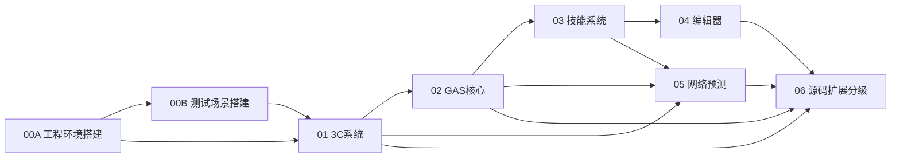
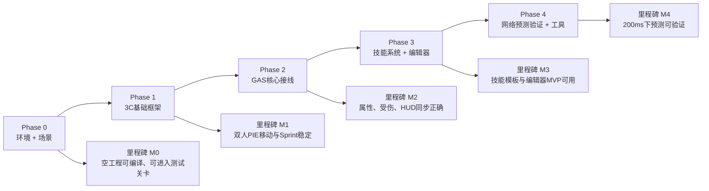
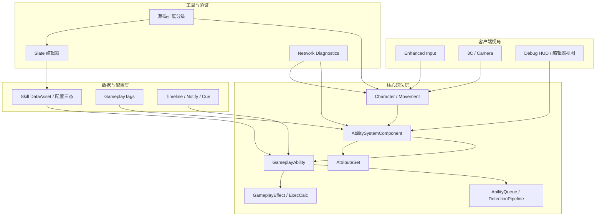

# ZZC Demo：总览索引与实施导航

> 这套文档面向两个目标同时服务：
> 1. 能按顺序把 UE5 GAS Demo 从空工程做到可联机、可配技能、可验证预测。
> 2. 能把关键架构、设计取舍和扩展边界讲清楚，方便复盘与面试表达。
>
> 推荐阅读顺序：`00A 工程环境` → `00B 测试场景` → `01 3C系统` → `02 GAS核心` → `03 技能系统` → `04 编辑器` → `05 网络预测` → `06 源码扩展分级`

---

## 项目规则

| 规则 | 说明 |
|------|------|
| 统一版本 | 主线以 UE 5.4 为准，默认使用 Launcher 版即可完成 Demo |
| 文档口径 | “Phase” 表示实现阶段；“验收”表示可复现的完成标准；“设计决策”表示明确取舍 |
| 图示规范 | 统一使用 Mermaid 内嵌图；每张图都配“图解说明”，避免只给图不给解释 |
| Demo 范围 | 先做完整纵切链路，再做增强项；不为了“看起来高级”提前引入重型方案 |
| 架构原则 | 先保证联机正确性，再讨论手感、编辑器体验和源码级扩展 |

---

## 文档依赖图

图解说明：
- 这张图表达的是“阅读与实现依赖”，不是代码模块依赖。
- `00A` 和 `00B` 共同构成 Phase 0，后面所有章节都默认这两篇已经完成。
- `05 网络预测` 不是孤立能力，它依赖 `01~03` 已经有正确的本地预测和复制链路。
- `06 源码扩展分级` 用来帮助判断“哪些事情现在就做、哪些只需理解边界”。

---

## Phase 时间线与里程碑

图解说明：
- 里程碑按“能否验证一条完整链路”定义，不按代码量定义。
- 每个阶段结束前都要做对应验收，不建议“先写完再一起验”。
- 如果某阶段验收不过，优先回退到上一里程碑定位依赖链，而不是盲目往后推进。

---

## 系统总架构图

图解说明：
- `Input / Camera / Character` 解决 Phase 1 的“能动、能看、能联机移动”。
- `ASC / AttributeSet / Ability / Effect` 是 Phase 2 到 Phase 4 的主干。
- `DataAsset / Timeline / Tags` 是技能配置层，编辑器只是它们的可视化入口，不是运行时核心。
- `Network Diagnostics` 和 `源码扩展分级` 都属于“帮助验证与表达”的工具层。

---

## 文档导航

| 阶段 | 文档 | 关注重点 | 进入条件 | 完成标志 |
|------|------|----------|----------|----------|
| Phase 0 | [00A 工程环境搭建](GAS-3C-Demo-00A-工程环境搭建.md) | 工程创建、模块依赖、GameInstance / GameMode 挂接 | UE 5.4 已安装 | 工程可编译、基础类可创建 |
| Phase 0 | [00B 测试场景搭建](GAS-3C-Demo-00B-测试场景搭建.md) | 蓝图包装、动画蓝图、测试关卡、默认生成流程 | 00A 完成 | 测试关卡中能正常生成可操作角色 |
| Phase 1 | [01 3C系统](GAS-3C-Demo-01-3C系统.md) | 角色、镜头、控制、Sprint 预测 | 00A/00B 完成 | 双人 PIE 下移动与 Sprint 稳定 |
| Phase 2 | [02 GAS核心](GAS-3C-Demo-02-GAS核心.md) | ASC 接线、AttributeSet、伤害数据流 | Phase 1 完成 | 属性同步、受伤与 HUD 正确 |
| Phase 3 | [03 技能系统](GAS-3C-Demo-03-技能系统.md) | 技能模板、配置三态、检测管线 | Phase 2 完成 | 4 类技能模板与核心流程可用 |
| Phase 3 | [04 编辑器](GAS-3C-Demo-04-编辑器.md) | Slate 编辑器、Tag 选择、Timeline 数据结构 | 03 基础数据层存在 | DataAsset 可双击打开并保存 |
| Phase 4 | [05 网络预测](GAS-3C-Demo-05-网络预测.md) | 预测、确认、回滚、诊断工具 | 01~03 主链可运行 | 200ms 下预测行为可解释可验证 |
| 辅助 | [06 源码扩展分级](GAS-3C-Demo-06-源码扩展分级.md) | 子类化 vs 改源码边界、扩展路线 | 任意阶段可读 | 能判断当前需求属于哪一级扩展 |

---

## 推荐实现顺序

### Phase 0：工程与测试基座

1. 完成 `00A` 的工程创建、模块依赖、插件开启、基础框架类创建。
2. 创建 `ZZCGameInstance`、`ZZCGameMode`、`ZZCHeroCharacter` 的最小可运行链路。
3. 完成 `00B` 的蓝图包装与测试关卡，让角色能在关卡中被正确生成。

### Phase 1：3C 主体

1. 完成移动、转向、相机和输入映射。
2. 完成 Sprint 本地预测和双人 PIE 验证。
3. 把 Camera 参数和角色朝向模式调到“够用且稳定”。

### Phase 2：GAS 主干

1. 把 ASC、AttributeSet、PlayerState、Character 的挂载链打通。
2. 建立默认属性初始化、受伤处理、HUD 显示的闭环。
3. 明确 Meta Attribute 与 ExecCalc 的职责边界。

### Phase 3：技能与编辑器

1. 搭出技能模板与配置三态。
2. 补齐技能执行主流程、队列和检测管线。
3. 再做 Slate 编辑器，把数据层可视化。

### Phase 4：网络预测与验证工具

1. 验证现有移动和技能的本地预测是否成立。
2. 对比“即时反馈”和“服务端确认”的时间差。
3. 用诊断工具把预测问题变成可视化、可复现、可解释的问题。

---

## 图例规范

| 图类型 | 用途 | 建议方向 |
|------|------|------|
| `flowchart` | 表示依赖、流程、决策树 | 左到右或上到下 |
| `sequenceDiagram` | 表示客户端/服务端时序 | 自左向右 |
| `stateDiagram-v2` | 表示状态机、模式切换 | 上到下 |
| `graph TD/LR` | 表示结构关系图 | 与同类章节保持一致 |

统一约定：
- 图里尽量用短语，不塞整段解释。
- 图后必须有“图解说明”，说清阅读顺序和设计结论。
- 同一概念在不同文档中的命名保持一致，例如统一写 `ASC`、`GameInstance`、`AbilityQueue`。

---

## 全局验收清单

- [ ] `00A` 完成后：工程可编译，插件启用，基础框架类可创建
- [ ] `00B` 完成后：测试关卡内角色可生成、可控制、动画与相机工作正常
- [ ] `01` 完成后：双人 PIE 下移动 / Sprint / Camera 行为稳定
- [ ] `02` 完成后：属性初始化、受伤、HUD 同步无明显错位
- [ ] `03` 完成后：技能模板可实例化，技能执行链路跑通
- [ ] `04` 完成后：DataAsset 可双击进入编辑器，Tag 选择和保存工作正常
- [ ] `05` 完成后：延迟环境下预测与确认行为可观察、可解释、可调试
- [ ] `06` 阅读后：能清楚区分“项目层可做”“子类化扩展”“必须改源码”三类方案

---

## 常见全局误区

### 1. 还没搭好测试关卡就开始做 GAS

问题：很多“GAS 不工作”其实是角色压根没被正确生成，或者默认类没挂上。

建议：先完成 Phase 0，再进入 01/02。

### 2. 把“预测”理解成 Phase 4 才开始做

问题：预测不是后补特性，而是从 Sprint、Ability 激活开始就要按正确方式搭。

建议：Phase 1 就把移动预测做对，Phase 4 做的是验证和诊断。

### 3. 把 Source Build 当作前置门槛

问题：Demo 主线大多数内容都能在 Launcher 版完成。

建议：先用 Launcher 版把主链跑通；只有需要查源码细节或评估源码级扩展时，再补 Source Build 环境。

---

## 建议阅读策略

- 第一次做：按文档顺序通读并落地，重点看“实现顺序”和“验收标准”。
- 第二次复盘：重点看每篇的“本篇总览图”“设计决策”“常见问题”。
- 准备表达：把 `01 / 02 / 03 / 05 / 06` 的设计决策串起来，形成完整的技术叙事。

---

## 待后续增强

- 追加截图版操作说明，专门服务第一次接触 UE 的读者。
- 为每个 Phase 增加”最小完成版”和”增强版”对照清单。

---

## 面试表达提纲

> 这份提纲用于从 Demo 中提炼面试高频问题与回答框架。每个话题对应文档中的具体实现，确保”讲得出来”的每一点都有代码和设计决策支撑。

### 1. 3C 系统设计（Phase 1）

**高频问题**：你怎么处理 Sprint 的网络预测？

**回答框架**：
- Sprint 不是简单复制一个 bool，而是把状态写进 `SavedMove`（`FZZCSavedMove`）。
- 通过 `GetCompressedFlags / UpdateFromCompressedFlags / PrepMoveFor` 三个覆盖点，让 Sprint 进入 CMC 的预测-重放链路。
- 额外保存 `SprintStartTime` 用于体力消耗的预测计算。
- 这样做的好处：服务端修正时客户端用正确的速度重放，避免拉扯和抖动。

**高频问题**：相机与角色的朝向关系怎么设计？

**回答框架**：
- 探索态：角色朝向移动方向（`bOrientRotationToMovement`），相机跟随控制器旋转。
- 这样做的好处：玩家自然地感受到”角色跟着我走”而非”角色面对镜头”。
- 后续扩展到战斗态可以切换为 Strafe 模式。

### 2. GAS 架构（Phase 2）

**高频问题**：ASC 为什么放在 PlayerState 而不是 Character？

**回答框架**：
- Character 负责表现和动作，PlayerState 负责跨 Pawn 的持续玩法状态。
- 玩家重生、换 Pawn 时 ASC 保持稳定宿主，不需要重新初始化。
- 这是 Lyra 和其他成熟 GAS 项目的标准做法。

**高频问题**：你的伤害计算管线是怎么设计的？

**回答框架**：
- 使用 Meta Attribute 模式：Ability → GE → ExecCalc → MetaDamage → PostGameplayEffectExecute → Health 扣减。
- 伤害过程使用结构化数据（`FZZCDamageEvaluation`），包含基础伤害、暴击、护甲减伤、命中位置等。
- 伤害类型用 GameplayTag（Physical/Magic/True）而非枚举，治疗走独立 GE 路径。
- 这样做的好处：公式可扩展、过程可追踪、输入与结果分离。

**高频问题**：AttributeSet 怎么拆分？

**回答框架**：
- Base（Health、MaxHealth、MoveSpeed、Stamina）+ Combat（Attack、Defense、Crit、MetaDamage）。
- 拆分目的：职责隔离、非战斗角色不需要 Combat 属性。
- 使用 `ReplicatedUsing + OnRep` 做属性复制，HUD 和特效系统从回调获得更新通知。

### 3. 技能系统（Phase 3）

**高频问题**：你的技能系统是怎么组织的？

**回答框架**：
- 配置三态：AbilitySet（角色拥有哪些技能）、AbilityConfig（技能参数）、AbilityPriority（冲突优先级）。
- 4 种模板：Instant / Duration / Channeled / Passive，统一基类收束共性。
- 技能执行主干：CanActivate → ActivateAbility → Timeline/Montage → Detection → GE/Cue → EndAbility。

**高频问题**：命中检测怎么做？

**回答框架**：
- 统一的 DetectionPipeline，配置化的检测形状（Sphere/Box/Capsule/Cone/Trace）。
- 支持 `FGameplayTagQuery` 做目标过滤（活着的、非无敌的、敌方的）。
- Cone 检测用于近战横扫，比 Sphere + 角度后过滤更直观。

### 4. 网络预测（Phase 4）

**高频问题**：你怎么验证预测是否正确？

**回答框架**：
- 在 200ms 延迟环境下做系统性测试。
- 使用 `FZZCNetworkMetrics` 收集输入时间戳、预测位置、服务端修正位置、回滚次数。
- DrawDebug 可视化：绿色=预测位置、红色=服务端位置、黄色线=回滚修正轨迹。
- 回滚本身不是失败，关键看频率、幅度和可解释性。

**高频问题**：预测和确认的时序是怎样的？

**回答框架**：
- 客户端先本地执行 → 发送请求到服务端 → 服务端权威验证 → 返回确认或修正 → 客户端接受或回滚重放。
- 移动预测依赖 CMC 的 SavedMove 机制，技能预测依赖 GAS 的 FPredictionKey 机制。

### 5. 扩展性设计（Phase 6）

**高频问题**：你怎么决定一个需求该在项目层做还是改源码？

**回答框架**：
- 三级分类：项目层 → 子类化扩展 → 源码级改动，成本和维护代价递增。
- 先问”有没有公开扩展点”，再问”是不是必须碰核心行为”。
- Demo 主线完全在 Launcher 版完成，不改引擎源码。
- 实际例子：Sprint 预测 = 子类化（扩展 CMC），技能编辑器 = 项目层（Editor-only 插件）。

### 表达原则

- 每个回答先说结论，再说原因，最后说好处。
- 用具体的类名和函数名而非抽象概念，让面试官感觉到”真的写过”。
- 主动说出”备选方案 + 为什么不选”，展示设计思考而非只是执行。
