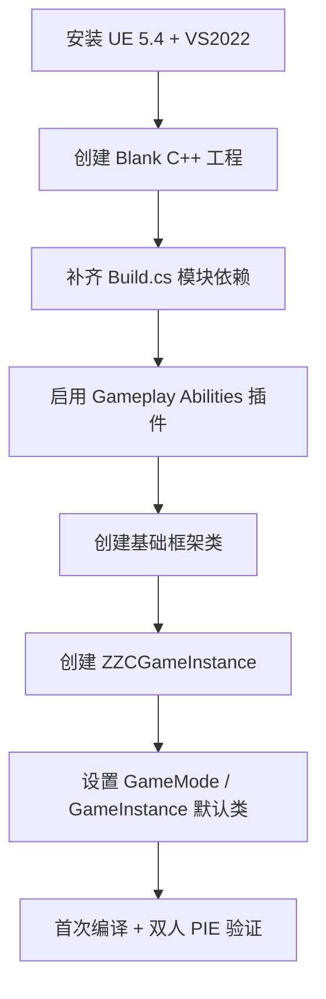
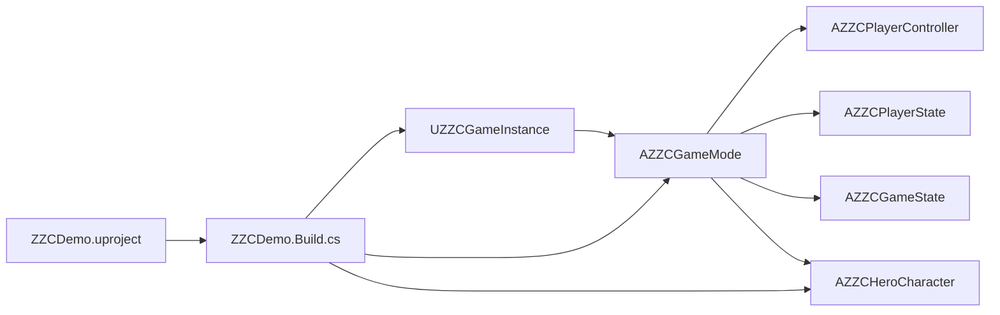
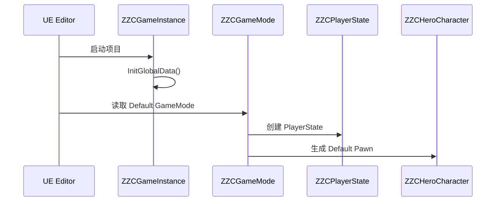

# ZZC Demo：工程环境搭建（从零开始）

> **对应阶段：** Phase 0  
> **目标产出：** 创建可编译运行的 UE 5.4 C++ 工程，打通 `GameInstance -> GameMode -> Character` 最小启动链，为后续 3C / GAS / 技能系统做准备。  
> **完成标准：** 工程可编译，基础类可创建，双人 PIE 能生成两个默认 Pawn。  
> **相关文档：** [总览索引](GAS-3C-Demo-00-总览索引.md) | [测试场景搭建](GAS-3C-Demo-00B-测试场景搭建.md) | [3C系统](GAS-3C-Demo-01-3C系统.md)

---

## 本篇总览图



图解说明：
- 这张图强调的是“前置依赖顺序”，不是文件修改顺序。
- `ZZCGameInstance` 不是可选项，它是 GAS 全局初始化和后续系统挂接的显式前置条件。
- 如果你跳过 `GameMode / GameInstance` 挂接，后续很多问题会表现成“代码没错但运行不生效”。

---

## 前置依赖

### 软件要求

| 项目 | 版本 | 说明 |
|------|------|------|
| Unreal Engine | 5.4.x | 推荐 Launcher 安装版即可，不要求源码版 |
| Visual Studio | 2022 | 勾选“使用 C++ 的游戏开发” |
| Windows SDK | 最新稳定版 | 跟随 VS 安装 |

### 为什么默认用 Launcher 版

- 本 Demo 主线以项目层实现和子类化扩展为主，绝大多数内容不需要改引擎源码。
- 只有在查阅底层实现细节、做源码级扩展评估时，才需要额外准备 Source Build。
- 先把主链做通，比一开始就搭重环境更重要。

---

## 工程启动依赖图



图解说明：
- `Build.cs` 是所有 C++ 类能否正确编译的依赖入口。
- `GameInstance` 和 `GameMode` 是两层不同职责：前者负责全局初始化，后者负责运行时默认类与生成规则。
- 这篇先把“启动骨架”搭起来，动画蓝图、Mesh、测试关卡留给 `00B`。

---

## 第一步：创建正确的空工程

### 推荐选项

| 选项 | 推荐值 | 原因 |
|------|--------|------|
| 模板 | `Games -> Blank` | 保持工程干净，避免和现成 Blueprint Character 打架 |
| 语言 | `C++` | 后续要直接写 GAS / CMC / Ability 代码 |
| Starter Content | 关闭 | 减少无关内容 |
| 质量预设 | Scalable | 适合开发与联机验证 |
| 路径 | 英文路径 | 避免编译和工具链路径问题 |
| 项目名 | `ZZCDemo` | 和文档、模块名保持一致 |

### 不推荐直接用 Third Person 模板

- Third Person 自带 Character、Input 和相机逻辑，容易和后续自己的 `ZZCHeroCharacter` 重叠。
- 如果你只想“先跑起来”，也建议在 Blank 工程里自行搭最小角色链，这样后面更好控。

---

## 第二步：配置 Build.cs

### 必备模块

```csharp
PublicDependencyModuleNames.AddRange(new string[]
{
    "Core",
    "CoreUObject",
    "Engine",
    "InputCore",
    "GameplayAbilities",
    "GameplayTags",
    "GameplayTasks",
    "EnhancedInput",
    "NetCore",
    "UMG",
    "Slate",
    "SlateCore",
});

PrivateDependencyModuleNames.AddRange(new string[]
{
    "AnimationCore",
});
```

### 这一步的目标

- 先把后续 Phase 1~4 会稳定用到的模块准备好。
- `GameplayAbilities / Tags / Tasks` 是 GAS 核心三件套。
- `EnhancedInput`、`NetCore`、`UMG` 是后续 Phase 1~4 主链都会用到的模块。

---

## 第三步：启用插件

### 必开插件

| 插件 | 用途 | 是否必须 |
|------|------|----------|
| Gameplay Abilities | GAS 核心 | 必须 |
| Enhanced Input | 现代输入系统 | 必须 |

### 建议操作

1. 打开 `Edit -> Plugins`
2. 搜索并启用 `Gameplay Abilities`
3. 确认 `Enhanced Input` 已启用
4. 点击 `Restart Now`

---

## 第四步：创建基础目录与类骨架

### 推荐目录

```text
Source/ZZCDemo/
├── Core/
├── Character/
├── Input/
├── GAS/
│   ├── Attributes/
│   ├── Abilities/
│   ├── Effects/
│   ├── Tasks/
│   ├── Components/
│   ├── Tags/
│   └── Config/           // 配置数据（DataAsset、DamageTable 等）
├── Network/
├── UI/
└── Editor/               // 编辑器扩展（Editor-only，不进入运行时模块）
```

### 目录设计说明

- `GAS/Config/`：技能配置三态、伤害表、属性初始化等 DataAsset 统一存放于此，避免配置散落在各功能目录中。
- `Editor/`：编辑器插件代码独立于运行时模块，Phase 3 的 Slate 编辑器和数据验证工具放在这里。

### 第一批必须创建的类

| 顺序 | 类名 | 父类 | 作用 |
|------|------|------|------|
| 1 | `ZZCGameInstance` | `UGameInstance` | GAS 全局初始化入口 |
| 2 | `ZZCGameMode` | `AGameModeBase` | 默认类与生成规则 |
| 3 | `ZZCPlayerState` | `APlayerState` | 后续挂载 ASC 的宿主 |
| 4 | `ZZCPlayerController` | `APlayerController` | 输入入口 |
| 5 | `ZZCGameState` | `AGameStateBase` | 全局状态容器 |
| 6 | `ZZCCharacterBase` | `ACharacter` | 角色基类 |
| 7 | `ZZCHeroCharacter` | `ZZCCharacterBase` | 主角类 |
| 8 | `ZZCCharacterMovementComponent` | `UCharacterMovementComponent` | Sprint / MOVE_Custom 扩展入口 |
| 9 | `ZZCAnimInstance` | `UAnimInstance` | 动画参数桥接 |

> 这里明确把 `ZZCGameInstance` 放进主流程，避免它只出现在 FAQ 里。

---

## 第四步补充：建立分类日志系统

### 为什么从项目初期就要做

- 后续 GAS、Movement、Network 各系统的调试信息会大量增加。
- 如果全用默认 `LogTemp`，很难在 Output Log 中过滤定位问题。
- 成本极低（几行宏定义），但对整个开发周期的调试效率提升很大。

### 推荐做法：使用 UE_LOG 原生分类

```cpp
// ZZCDemo.h 或 Core/ZZCLogCategories.h
DECLARE_LOG_CATEGORY_EXTERN(LogZZC,        Log, All);  // 通用
DECLARE_LOG_CATEGORY_EXTERN(LogZZCAbility, Log, All);  // GAS / 技能
DECLARE_LOG_CATEGORY_EXTERN(LogZZCMovement,Log, All);  // 移动 / 预测
DECLARE_LOG_CATEGORY_EXTERN(LogZZCNetwork, Log, All);  // 网络 / 诊断
DECLARE_LOG_CATEGORY_EXTERN(LogZZCEditor,  Log, All);  // 编辑器

// ZZCDemo.cpp 或 Core/ZZCLogCategories.cpp
DEFINE_LOG_CATEGORY(LogZZC);
DEFINE_LOG_CATEGORY(LogZZCAbility);
DEFINE_LOG_CATEGORY(LogZZCMovement);
DEFINE_LOG_CATEGORY(LogZZCNetwork);
DEFINE_LOG_CATEGORY(LogZZCEditor);
```

### 使用约定

- 各系统在自己的代码中使用对应的 Category，不要全用 `LogTemp`。
- 不需要自定义日志封装类，UE5 原生的 `UE_LOG` 宏 + 自定义 Category 已经足够。
- 在 Output Log 中可以通过 Category 名称快速过滤。

---

## 第五步：实现 GameInstance 与默认类挂接

### 1. `ZZCGameInstance::Init()`

```cpp
void UZZCGameInstance::Init()
{
    Super::Init();
    UAbilitySystemGlobals::Get().InitGlobalData();
}
```

### 2. `ZZCGameMode` 设置默认类

```cpp
AZZCGameMode::AZZCGameMode()
{
    DefaultPawnClass = AZZCHeroCharacter::StaticClass();
    PlayerStateClass = AZZCPlayerState::StaticClass();
    PlayerControllerClass = AZZCPlayerController::StaticClass();
    GameStateClass = AZZCGameState::StaticClass();
}
```

### 3. 项目设置中必须配置

| 设置位置 | 配置项 | 值 |
|------|------|------|
| `Project Settings -> Maps & Modes` | `Game Instance Class` | `ZZCGameInstance` |
| `Project Settings -> Maps & Modes` | `Default GameMode` | `ZZCGameMode` |

### 为什么这一段必须显式写出来

- 只创建类但不在项目设置中挂上，运行时不会自动生效。
- `GameInstance` 没挂上时，最常见现象是 GAS 全局初始化缺失，后续 GameplayCue / Ability 相关问题很难追。

---

## 第六步：创建最小可运行角色

### CMC 替换方式统一用 `SetDefaultSubobjectClass`

```cpp
AZZCHeroCharacter::AZZCHeroCharacter(const FObjectInitializer& ObjectInitializer)
    : Super(ObjectInitializer.SetDefaultSubobjectClass<UZZCCharacterMovementComponent>(
        ACharacter::CharacterMovementComponentName))
{
}
```

### 这一点为什么要提前定死

- 后续文档统一按“替换默认子对象”来写，不再混用 `CreateDefaultSubobject`。
- 这样能保证 `CharacterMovement` 仍然是引擎预期的默认组件，只是类型被替换成自定义子类。

---

## 第七步：首次编译与工程验证

### 编译流程

1. 右键 `.uproject`，执行 `Generate Visual Studio project files`
2. 在 Visual Studio 中执行 `Build Solution`
3. 启动编辑器，打开项目
4. 在 `Play in Editor` 中把 `Number of Players` 设为 `2`

### 启动链验证图



图解说明：
- 这是最小启动时序，不涉及动画蓝图、Mesh 和测试关卡细节。
- 如果角色没生成，优先查 `Default GameMode`；如果 GAS 初始化异常，优先查 `Game Instance Class`。

---

## 验收标准

- [ ] UE 5.4 与 VS2022 已安装完成
- [ ] `GameplayAbilities` 与 `EnhancedInput` 插件已启用
- [ ] `ZZCDemo.Build.cs` 已包含 GAS / Input / Network 相关模块
- [ ] 分类日志 Category 已定义（LogZZC / LogZZCAbility / LogZZCMovement / LogZZCNetwork）
- [ ] `ZZCGameInstance::Init()` 已调用 `InitGlobalData()`
- [ ] `Game Instance Class` 已设置为 `ZZCGameInstance`
- [ ] `Default GameMode` 已设置为 `ZZCGameMode`
- [ ] 9 个基础类已创建且可通过编译
- [ ] 双人 PIE 下能生成两个默认 Pawn

---

## 常见问题

### Q1：`AbilitySystemGlobals` 或 `AbilitySystemComponent.h` 报红

检查项：
- `Build.cs` 是否添加了 `GameplayAbilities`
- 是否重新生成了 Project Files
- 头文件是否正确 include

### Q2：编译能过，但运行时像是“GameInstance 没生效”

检查项：
- `Project Settings -> Maps & Modes -> Game Instance Class`
- `ZZCGameInstance::Init()` 是否被调用
- 是否误以为“创建类 = 已挂接”

### Q3：角色生成了，但不是自己的 `ZZCHeroCharacter`

检查项：
- `Default GameMode` 是否真的是 `ZZCGameMode`
- `ZZCGameMode` 构造函数里是否设置了 `DefaultPawnClass`

### Q4：为什么这里就要建 `ZZCAnimInstance`，明明还没做动画

原因：
- 这是 Phase 0 的“骨架预留”，方便 `00B` 直接接动画蓝图和测试关卡。
- 先留类，再在下一篇把蓝图包装和资源绑定补上。

---

## 设计决策

| 决策 | 选择 | 为什么这样做 | 备选方案 | Demo 为什么不选备选 |
|------|------|-------------|----------|--------------------|
| 引擎形态 | Launcher 版 UE 5.4 | 足够完成主线 | 一开始就 Source Build | 增加环境成本，延后可验证结果 |
| 工程模板 | Blank C++ | 最干净、控制权最高 | Third Person | 自带逻辑太多，易和后续角色架构冲突 |
| GAS 初始化入口 | `GameInstance::Init()` | 全局、明确、可追踪 | 分散在其他启动点 | 不利于统一定位问题 |
| CMC 替换方式 | `SetDefaultSubobjectClass` | 兼容默认组件语义 | 构造函数里重新建组件 | 容易让文档和实现混乱 |

---

## 参考资料

- Unreal Engine 5.4 官方文档
- Gameplay Ability System 官方文档
- Enhanced Input 官方文档
- Lyra Starter Game
