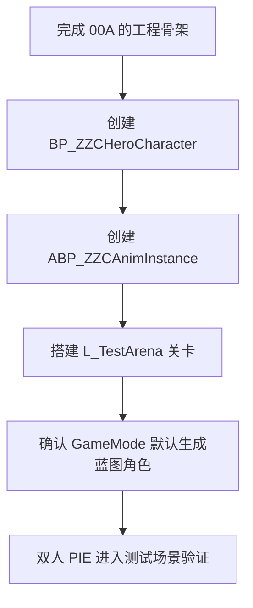
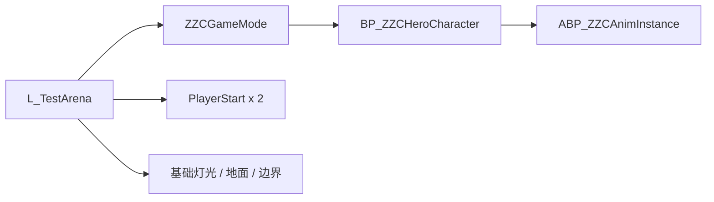
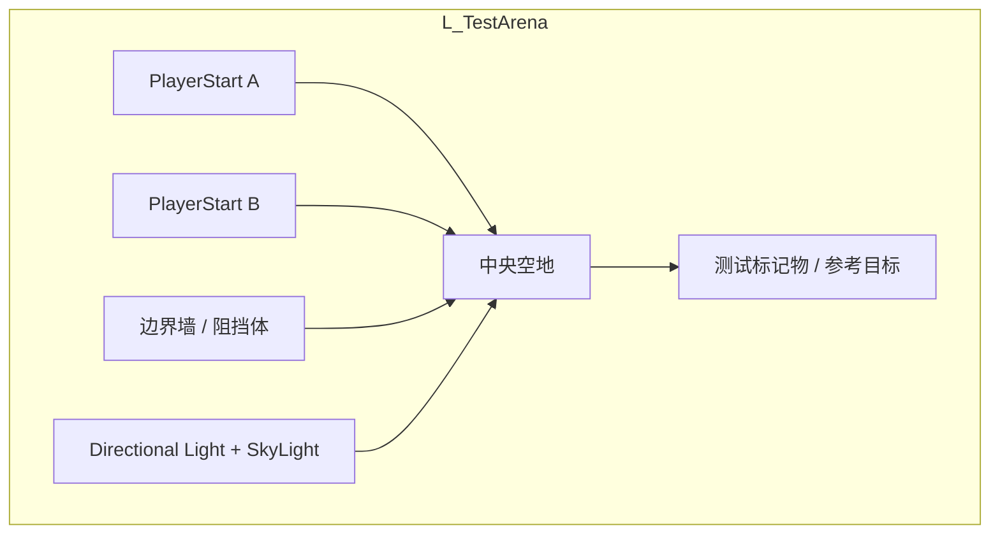
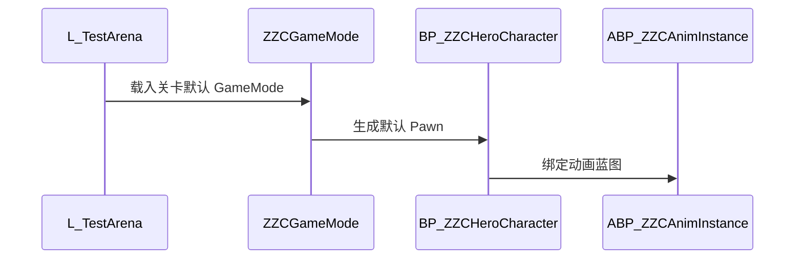

# ZZC Demo：测试场景搭建

> **对应阶段：** Phase 0  
> **目标产出：** 创建可重复使用的测试关卡、蓝图包装类和动画蓝图，让后续 3C / GAS / 技能验证都能在同一场景中进行。  
> **完成标准：** `BP_ZZCHeroCharacter` 能在测试关卡中被 `ZZCGameMode` 正确生成，双人 PIE 可进入同一场景并正常控制角色。  
> **相关文档：** [工程环境搭建](GAS-3C-Demo-00A-工程环境搭建.md) | [3C系统](GAS-3C-Demo-01-3C系统.md)

---

## 本篇总览图

图解说明：
- 这篇的目标不是“做漂亮场景”，而是做一个稳定的验证基座。
- `BP_ZZCHeroCharacter` 和 `ABP_ZZCAnimInstance` 是资源配置层，目的是把 C++ 骨架和编辑器资源绑定起来。
- 后面所有 Phase 的演示、回归和截图，都建议在同一个 `L_TestArena` 中完成。

---

## 前置依赖

- 已完成 [00A 工程环境搭建](GAS-3C-Demo-00A-工程环境搭建.md)
- 已具备 `ZZCGameMode`、`ZZCHeroCharacter`、`ZZCAnimInstance`
- 已能正常进入编辑器并通过 C++ 编译

---

## 测试场景组成图

图解说明：
- `GameMode` 决定生成谁，`BP_ZZCHeroCharacter` 决定资源如何绑定，`L_TestArena` 决定测试是否稳定可复现。
- 如果后续“角色没有 Mesh / 没动画 / 出生错误”，这三层要分开排查。

---

## 第一步：创建蓝图包装类 `BP_ZZCHeroCharacter`

### 为什么需要蓝图包装

- C++ 类更适合承载行为和系统接线。
- 蓝图子类更适合绑定 Mesh、动画蓝图、材质和编辑器可调参数。
- 这样能避免把资源路径硬编码进 C++，后续换资源也更轻松。

### 建议步骤

1. 在 Content Browser 中基于 `ZZCHeroCharacter` 创建 Blueprint 子类
2. 命名为 `BP_ZZCHeroCharacter`
3. 把骨骼网格、碰撞胶囊、SpringArm、Camera 的基础参数在蓝图中确认一遍

---

## 第二步：创建 `ABP_ZZCAnimInstance`

### 目标

- 让角色具备最小的 Idle / Walk / Run / InAir 动画切换能力
- 为 Phase 1 的方向计算、Sprint 层和 BlendSpace 调参做准备

### 推荐最小变量

| 变量 | 来源 | 用途 |
|------|------|------|
| `Speed` | `ZZCAnimInstance` | 速度驱动状态切换 |
| `Direction` | `ZZCAnimInstance` | 方向与 BlendSpace |
| `bIsInAir` | `CharacterMovement` | 落地 / 跳跃判断 |
| `bIsAccelerating` | `CharacterMovement` | 起步 / 停步过渡 |

---

## 第三步：搭建测试关卡 `L_TestArena`

### 关卡目标

- 空间足够移动、转向、冲刺和技能演示
- 布局简单、光照稳定、容易观察
- 支持双人 PIE 出生和基础联机验证

### 关卡拓扑图

图解说明：
- 测试关卡建议优先服务“可观察性”，不是追求复杂美术表现。
- 两个 `PlayerStart` 是后续双人 PIE 的前置条件，应该在 Phase 0 就准备好。
- 中央空地建议保留一段直线路径和一块空旷区域，方便测移动、相机和技能范围。

### 推荐布局

- 地面：一块规则平面，便于看移动与落地
- 边界：简单阻挡体，避免角色跑出观察区域
- 光照：固定、稳定，不影响动画和特效可见性
- 标记物：可放几个立方体/靶子，供后续技能和锁定系统调试

---

## 第四步：确认默认生成的是蓝图角色

### 生成链路图

图解说明：
- 这一步解决“C++ 骨架”和“资源绑定”之间的落差。
- 文档主线建议让 `GameMode` 最终生成蓝图包装类，而不是直接生成纯 C++ 角色。
- 这样测试场景和后续功能演示看到的，才是最接近最终表现的角色。

### 两种可接受方案

| 方案 | 说明 | 适用阶段 |
|------|------|----------|
| 方案 A | `DefaultPawnClass = AZZCHeroCharacter::StaticClass()` | 刚搭骨架时可用 |
| 方案 B | 在项目设置或蓝图中让 `GameMode` 生成 `BP_ZZCHeroCharacter` | 推荐作为 Phase 0 最终状态 |

推荐原因：
- Phase 0 后半段就切到蓝图包装类，后续测试更稳定，不会反复解释“为什么我看不到动画”。

---

## 第五步：双人 PIE 验证

### 操作路径

1. 打开 `L_TestArena`
2. `Play -> Advanced Settings`
3. 把 `Number of Players` 设为 `2`
4. 确认 `Net Mode` 为 `Play As Listen Server`
5. 开始 PIE

### 通过标准

- 两个玩家都能在测试关卡中出生
- 两个角色都能看到正确的 Mesh
- 动画蓝图已经生效，不是 T-Pose
- 相机和基础控制正常

---

## 验收标准

- [ ] `BP_ZZCHeroCharacter` 已创建
- [ ] `ABP_ZZCAnimInstance` 已创建并绑定
- [ ] `L_TestArena` 已创建并可作为主测试关卡
- [ ] 关卡中至少有 2 个 `PlayerStart`
- [ ] 默认生成角色为蓝图包装类，或已明确保留切换计划
- [ ] 双人 PIE 可进入同一测试场景
- [ ] 角色不是 T-Pose，相机与基础控制正常

---

## 常见问题

### Q1：角色生成了，但没有 Mesh 或动画

优先检查：
- 是否真的生成了 `BP_ZZCHeroCharacter`
- 蓝图里是否绑定了正确骨骼网格
- `Anim Class` 是否设为 `ABP_ZZCAnimInstance`

### Q2：为什么不把 Mesh 和动画直接写死在 C++ 里

原因：
- 资源路径硬编码维护成本高
- 后续换资源、换皮肤、换动作会很痛
- Demo 里需要的不是“写死”，而是“可验证、可替换”

### Q3：双人 PIE 时两个玩家刷在一起

优先检查：
- 是否放置了两个足够分开的 `PlayerStart`
- `GameMode` 是否有自定义出生逻辑

### Q4：`DefaultPawnClass` 还指向 C++ 类，是否一定要立刻改成蓝图类

建议：
- Phase 0 最晚在场景搭好后切到蓝图类。
- 如果你暂时保留纯 C++ 角色，也要在文档里写明“这是临时状态”，避免后面忘了切换。

---

## 设计决策

| 决策 | 选择 | 为什么这样做 | 备选方案 | Demo 为什么不选备选 |
|------|------|-------------|----------|--------------------|
| 角色资源绑定方式 | C++ 行为 + 蓝图包装类 | 行为和资源解耦 | 全部写在 C++ | 资源维护成本高 |
| 测试关卡复杂度 | 简洁稳定 | 便于观察和回归 | 一开始做复杂演示关卡 | 会掩盖系统问题 |
| 默认 Pawn | 最终指向蓝图角色 | 贴近真实表现 | 一直保持纯 C++ 角色 | 不利于动画和资源调试 |

---

## 参考资料

- UE5 Blueprint 继承与动画蓝图官方文档
- Lyra Starter Game 的角色蓝图组织方式
