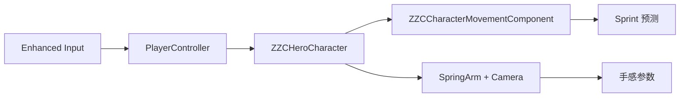
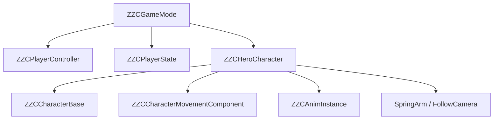
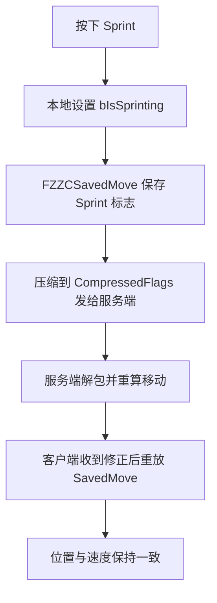
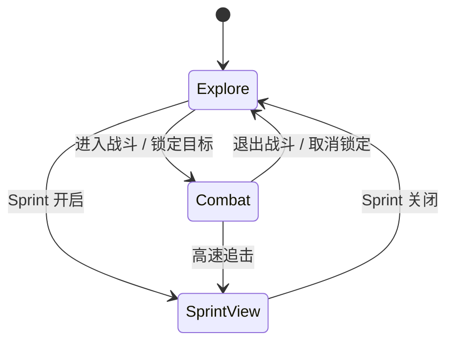
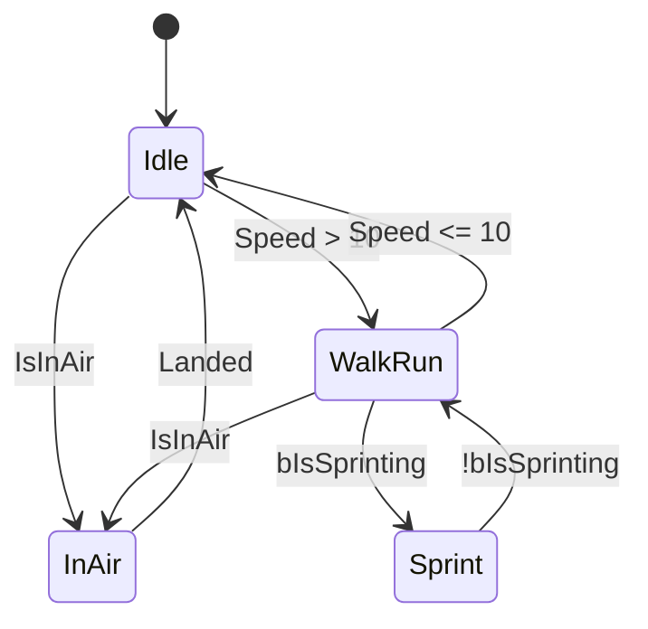

# ZZC Demo：3C 系统（角色·镜头·控制）

> **对应阶段：** Phase 1  
> **目标产出：** 局域网双人 PIE 下，角色移动、转向、Sprint 与 Camera 行为稳定，无明显抖动。  
> **完成标准：** 100ms 网络模拟下 Sprint 不出现明显拉扯；相机与角色朝向模式可解释、可调。  
> **相关文档：** [测试场景搭建](GAS-3C-Demo-00B-测试场景搭建.md) | [GAS核心](GAS-3C-Demo-02-GAS核心.md) | [网络预测](GAS-3C-Demo-05-网络预测.md)

---

## 本篇总览图



图解说明：
- 这张图表达的是 3C 的责任分工，不是类继承图。
- 输入先到 `PlayerController`，再分发到 `Character`；移动规则由 `CMC` 负责；相机手感由 SpringArm / Camera 参数控制。
- Sprint 的核心不是“把速度调大”，而是把状态纳入移动预测链。

---

## 组件关系图



图解说明：
- `PlayerState` 现在先作为骨架保留，真正承载 ASC 的工作在 Phase 2 展开。
- `ZZCHeroCharacter` 是 Phase 1 的焦点类，整合移动、相机和输入绑定。
- `ZZCCharacterMovementComponent` 只负责“运动规则与预测”，不要把 Camera 或 UI 逻辑塞进去。

---

## 实现顺序

1. 确认 `ZZCHeroCharacter` 已替换默认 `CharacterMovementComponent`
2. 完成 Move / Look / Jump / Sprint 的输入映射
3. 补齐 SpringArm 与 FollowCamera 的基础参数
4. 在 CMC 中实现 Sprint 状态、预测与速度覆盖
5. 用双人 PIE 和 100ms 延迟验证移动与 Sprint
6. 再补 `AnimInstance`、BlendSpace 与角色朝向策略

---

## 一、输入与角色骨架

### 输入链路

- `PlayerController`：接收并转发输入
- `Character`：把输入转换成移动、转向、跳跃、Sprint 状态
- `CMC`：决定实际移动速度和预测逻辑

### 推荐输入动作

| 动作 | 类型 | 说明 |
|------|------|------|
| `IA_Move` | `Axis2D` | 角色平面移动 |
| `IA_Look` | `Axis2D` | 镜头旋转 |
| `IA_Jump` | `Digital` | 跳跃 |
| `IA_Sprint` | `Digital` | 冲刺开关 |

### 1A. PlayerController 绑定 InputMappingContext

```cpp
// ZZCPlayerController.h
UPROPERTY(EditDefaultsOnly, Category="Input")
TObjectPtr<UInputMappingContext> DefaultMappingContext;

UPROPERTY(EditDefaultsOnly, Category="Input")
TObjectPtr<UInputAction> IA_Move;

UPROPERTY(EditDefaultsOnly, Category="Input")
TObjectPtr<UInputAction> IA_Look;

UPROPERTY(EditDefaultsOnly, Category="Input")
TObjectPtr<UInputAction> IA_Jump;

UPROPERTY(EditDefaultsOnly, Category="Input")
TObjectPtr<UInputAction> IA_Sprint;
```

```cpp
// ZZCPlayerController.cpp
void AZZCPlayerController::BeginPlay()
{
    Super::BeginPlay();

    // 添加 InputMappingContext
    if (UEnhancedInputLocalPlayerSubsystem* Subsystem =
        ULocalPlayer::GetSubsystem<UEnhancedInputLocalPlayerSubsystem>(GetLocalPlayer()))
    {
        Subsystem->AddMappingContext(DefaultMappingContext, 0);
    }
}

void AZZCPlayerController::SetupInputComponent()
{
    Super::SetupInputComponent();

    UEnhancedInputComponent* EIC = CastChecked<UEnhancedInputComponent>(InputComponent);

    EIC->BindAction(IA_Move,   ETriggerEvent::Triggered, this, &ThisClass::HandleMove);
    EIC->BindAction(IA_Look,   ETriggerEvent::Triggered, this, &ThisClass::HandleLook);
    EIC->BindAction(IA_Jump,   ETriggerEvent::Started,   this, &ThisClass::HandleJump);
    EIC->BindAction(IA_Sprint, ETriggerEvent::Started,   this, &ThisClass::HandleSprintStart);
    EIC->BindAction(IA_Sprint, ETriggerEvent::Completed, this, &ThisClass::HandleSprintStop);
}
```

> **设计说明**：输入绑定放在 `PlayerController` 而非 `Character`，因为 PC 是输入的权威入口。PC 收到输入后调用 Character 的公开接口。如果你更习惯 Lyra 风格（绑定在 Pawn），也可以，但全项目要统一。

### 1B. Character 输入回调与 Camera 创建

```cpp
// ZZCHeroCharacter.h
UPROPERTY(VisibleAnywhere, BlueprintReadOnly, Category="Camera")
TObjectPtr<USpringArmComponent> SpringArm;

UPROPERTY(VisibleAnywhere, BlueprintReadOnly, Category="Camera")
TObjectPtr<UCameraComponent> FollowCamera;
```

```cpp
// ZZCHeroCharacter.cpp — 构造函数
AZZCHeroCharacter::AZZCHeroCharacter(const FObjectInitializer& ObjectInitializer)
    : Super(ObjectInitializer.SetDefaultSubobjectClass<UZZCCharacterMovementComponent>(
        ACharacter::CharacterMovementComponentName))
{
    // 不让 Controller 直接旋转角色，由 CMC 根据移动方向旋转
    bUseControllerRotationYaw = false;

    // SpringArm
    SpringArm = CreateDefaultSubobject<USpringArmComponent>(TEXT("SpringArm"));
    SpringArm->SetupAttachment(RootComponent);
    SpringArm->TargetArmLength = 350.0f;
    SpringArm->bUsePawnControlRotation = true;   // 跟随控制器旋转
    SpringArm->bEnableCameraLag = true;
    SpringArm->CameraLagSpeed = 10.0f;

    // Camera
    FollowCamera = CreateDefaultSubobject<UCameraComponent>(TEXT("FollowCamera"));
    FollowCamera->SetupAttachment(SpringArm, USpringArmComponent::SocketName);
    FollowCamera->bUsePawnControlRotation = false; // 由 SpringArm 驱动

    // 移动组件朝向设置
    GetCharacterMovement()->bOrientRotationToMovement = true;  // 朝向移动方向
    GetCharacterMovement()->RotationRate = FRotator(0.0f, 500.0f, 0.0f);
}
```

```cpp
// ZZCHeroCharacter.cpp — 输入回调（由 PlayerController 调用）
void AZZCHeroCharacter::HandleMove(const FInputActionValue& Value)
{
    const FVector2D Axis = Value.Get<FVector2D>();
    const FRotator YawRotation(0.0f, Controller->GetControlRotation().Yaw, 0.0f);

    // 根据相机朝向计算移动方向
    const FVector ForwardDir = FRotationMatrix(YawRotation).GetUnitAxis(EAxis::X);
    const FVector RightDir   = FRotationMatrix(YawRotation).GetUnitAxis(EAxis::Y);

    AddMovementInput(ForwardDir, Axis.Y);
    AddMovementInput(RightDir,   Axis.X);
}

void AZZCHeroCharacter::HandleLook(const FInputActionValue& Value)
{
    const FVector2D Axis = Value.Get<FVector2D>();
    AddControllerYawInput(Axis.X);
    AddControllerPitchInput(Axis.Y);
}

void AZZCHeroCharacter::HandleJump()
{
    Jump();
}

void AZZCHeroCharacter::SetSprinting(bool bNewSprint)
{
    if (UZZCCharacterMovementComponent* ZMC = GetZZCMovementComponent())
    {
        ZMC->SetSprinting(bNewSprint);
    }
}

UZZCCharacterMovementComponent* AZZCHeroCharacter::GetZZCMovementComponent() const
{
    return Cast<UZZCCharacterMovementComponent>(GetCharacterMovement());
}
```

> **关键点**：`HandleMove` 用控制器的 Yaw 旋转来计算前后左右方向，这样角色移动始终相对于相机朝向，是第三人称探索态的标准做法。

---

## 二、Sprint 预测核心

### 为什么“复制一个 bool”不够

- 服务端修正位置时，客户端会重放缓冲移动。
- 如果缓冲里没有记录“这一帧是否处于 Sprint”，客户端会用错误速度重算。
- 结果就是位置、速度和动画全都容易出现抖动或拉扯。

### Sprint 预测流转图



图解说明：
- 核心动作是“把 Sprint 状态放进 SavedMove”，而不是只在角色上记一个运行时变量。
- `CompressedFlags` 解决的是每帧运动意图同步问题，`Replicated` 变量解决不了这个层级的问题。
- `GetCompressedFlags / UpdateFromCompressedFlags / PrepMoveFor` 是这一链路里的关键点。

### 统一实现口径

唯一推荐写法：
- 在 `ZZCHeroCharacter` 构造函数里通过 `SetDefaultSubobjectClass<UZZCCharacterMovementComponent>()` 替换默认 CMC。
- 不再使用“在构造函数体内重新 `CreateDefaultSubobject` 一个 CharacterMovement”这种表述。

### 必做覆盖点

| 点位 | 作用 |
|------|------|
| `GetCompressedFlags()` | 打包 Sprint 标志 |
| `SetMoveFor()` | 保存当前 Sprint 状态 |
| `PrepMoveFor()` | 客户端重放时恢复 Sprint 状态 |
| `UpdateFromCompressedFlags()` | 服务端 / 客户端修正时解包 |
| `GetMaxSpeed()` | 按 Sprint 状态返回速度 |

### SavedMove 扩展建议

除了必须保存的 `bWantsToSprint` 标志外，建议额外保存 `SprintStartTime`：

```cpp
struct FZZCSavedMove : public FSavedMove_Character
{
    uint8 bWantsToSprint : 1;
    float SprintStartTime;     // Sprint 开始时间，用于计算体力消耗
};
```

`SprintStartTime` 的意义：
- 当服务端修正后客户端需要重放时，能正确计算该帧的体力消耗量。
- 如果不保存这个值，重放时体力计算会与服务端产生偏差，导致不必要的回滚。

### 2A. CMC 完整实现

```cpp
// ZZCCharacterMovementComponent.h
UCLASS()
class UZZCCharacterMovementComponent : public UCharacterMovementComponent
{
    GENERATED_BODY()

public:
    // Sprint 速度参数
    UPROPERTY(EditDefaultsOnly, Category="Sprint")
    float SprintMaxSpeed = 800.0f;

    UPROPERTY(EditDefaultsOnly, Category="Sprint")
    float WalkMaxSpeed = 600.0f;

    // Sprint 状态控制
    void SetSprinting(bool bNewSprint);
    bool IsSprinting() const { return bWantsToSprint; }

    // —— 覆盖点 ——
    virtual float GetMaxSpeed() const override;
    virtual FNetworkPredictionData_Client* GetPredictionData_Client() const override;
    virtual void UpdateFromCompressedFlags(uint8 Flags) override;

private:
    bool bWantsToSprint = false;

    // —— 自定义 SavedMove ——
    friend class FZZCSavedMove;
    friend class FZZCNetworkPredictionData;
};
```

### 2B. SavedMove 覆盖函数体

```cpp
// ZZCCharacterMovementComponent.cpp

// ==================== FZZCSavedMove ====================

class FZZCSavedMove : public FSavedMove_Character
{
public:
    uint8 bWantsToSprint : 1;
    float SprintStartTime = 0.0f;

    FZZCSavedMove() : bWantsToSprint(0) {}

    // —— 清空状态（每帧回收时调用）——
    virtual void Clear() override
    {
        FSavedMove_Character::Clear();
        bWantsToSprint = 0;
        SprintStartTime = 0.0f;
    }

    // —— 把当前 CMC 状态保存到 SavedMove ——
    virtual void SetMoveFor(ACharacter* C, float InDeltaTime,
        FVector const& NewAccel, FNetworkPredictionData_Client_Character& ClientData) override
    {
        FSavedMove_Character::SetMoveFor(C, InDeltaTime, NewAccel, ClientData);

        if (const UZZCCharacterMovementComponent* ZMC =
            Cast<UZZCCharacterMovementComponent>(C->GetCharacterMovement()))
        {
            bWantsToSprint = ZMC->bWantsToSprint;
            // 如果正在 Sprint，记录开始时间（用于体力计算重放）
            SprintStartTime = ZMC->IsSprinting() ?
                C->GetWorld()->GetTimeSeconds() : 0.0f;
        }
    }

    // —— 客户端重放时把 SavedMove 的状态恢复到 CMC ——
    virtual void PrepMoveFor(ACharacter* C) override
    {
        FSavedMove_Character::PrepMoveFor(C);

        if (UZZCCharacterMovementComponent* ZMC =
            Cast<UZZCCharacterMovementComponent>(C->GetCharacterMovement()))
        {
            ZMC->bWantsToSprint = bWantsToSprint;
        }
    }

    // —— 打包自定义标志到 CompressedFlags（发给服务端）——
    virtual uint8 GetCompressedFlags() const override
    {
        uint8 Result = FSavedMove_Character::GetCompressedFlags();

        if (bWantsToSprint)
        {
            Result |= FLAG_Custom_0;  // 使用引擎预留的自定义标志位
        }

        return Result;
    }

    // —— 判断两个 SavedMove 能否合并（减少网络包）——
    virtual bool CanCombineWith(const FSavedMovePtr& NewMove,
        ACharacter* InCharacter, float MaxDelta) const override
    {
        const FZZCSavedMove* Other = static_cast<const FZZCSavedMove*>(NewMove.Get());

        // Sprint 状态不同的帧不能合并，否则重放会出错
        if (bWantsToSprint != Other->bWantsToSprint)
        {
            return false;
        }

        return FSavedMove_Character::CanCombineWith(NewMove, InCharacter, MaxDelta);
    }
};
```

### 2C. NetworkPredictionData 与 CMC 函数体

```cpp
// —— 自定义 PredictionData，让引擎使用我们的 SavedMove ——

class FZZCNetworkPredictionData : public FNetworkPredictionData_Client_Character
{
public:
    FZZCNetworkPredictionData(const UCharacterMovementComponent& ClientMovement)
        : FNetworkPredictionData_Client_Character(ClientMovement) {}

    virtual FSavedMovePtr AllocateNewMove() override
    {
        return FSavedMovePtr(new FZZCSavedMove());
    }
};

// ==================== CMC 函数体 ====================

void UZZCCharacterMovementComponent::SetSprinting(bool bNewSprint)
{
    bWantsToSprint = bNewSprint;
}

float UZZCCharacterMovementComponent::GetMaxSpeed() const
{
    if (bWantsToSprint && IsMovingOnGround())
    {
        return SprintMaxSpeed;
    }
    return WalkMaxSpeed;
}

FNetworkPredictionData_Client* UZZCCharacterMovementComponent::GetPredictionData_Client() const
{
    // 首次调用时创建，后续复用
    if (!ClientPredictionData)
    {
        UZZCCharacterMovementComponent* MutableThis =
            const_cast<UZZCCharacterMovementComponent*>(this);
        MutableThis->ClientPredictionData =
            MakeUnique<FZZCNetworkPredictionData>(*this);
    }
    return ClientPredictionData.Get();
}

// 服务端收到 CompressedFlags 后解包恢复 Sprint 状态
void UZZCCharacterMovementComponent::UpdateFromCompressedFlags(uint8 Flags)
{
    Super::UpdateFromCompressedFlags(Flags);

    bWantsToSprint = (Flags & FSavedMove_Character::FLAG_Custom_0) != 0;
}
```

> **核心要点总结**：
> - `SetMoveFor` = 保存快照（CMC → SavedMove）
> - `PrepMoveFor` = 恢复快照（SavedMove → CMC），用于客户端重放
> - `GetCompressedFlags` = 打包发送（SavedMove → 网络包）
> - `UpdateFromCompressedFlags` = 解包接收（网络包 → CMC）
> - `CanCombineWith` = Sprint 状态不同的帧不能合并，否则重放速度会出错

### 2D. AnimInstance 最小实现

```cpp
// ZZCAnimInstance.h
UCLASS()
class UZZCAnimInstance : public UAnimInstance
{
    GENERATED_BODY()

public:
    virtual void NativeUpdateAnimation(float DeltaSeconds) override;

    UPROPERTY(BlueprintReadOnly, Category="Movement")
    float Speed = 0.0f;

    UPROPERTY(BlueprintReadOnly, Category="Movement")
    float Direction = 0.0f;

    UPROPERTY(BlueprintReadOnly, Category="Movement")
    bool bIsInAir = false;

    UPROPERTY(BlueprintReadOnly, Category="Movement")
    bool bIsAccelerating = false;

    UPROPERTY(BlueprintReadOnly, Category="Movement")
    bool bIsSprinting = false;
};
```

```cpp
// ZZCAnimInstance.cpp
void UZZCAnimInstance::NativeUpdateAnimation(float DeltaSeconds)
{
    Super::NativeUpdateAnimation(DeltaSeconds);

    if (const APawn* Pawn = TryGetPawnOwner())
    {
        // 速度和方向
        const FVector Velocity = Pawn->GetVelocity();
        Speed = Velocity.Size2D();
        Direction = CalculateDirection(Velocity, Pawn->GetActorRotation());

        if (const UCharacterMovementComponent* CMC =
            Cast<ACharacter>(Pawn)->GetCharacterMovement())
        {
            bIsInAir = CMC->IsFalling();
            bIsAccelerating = CMC->GetCurrentAcceleration().SizeSquared() > 0.0f;
        }

        // Sprint 状态从自定义 CMC 读取
        if (const UZZCCharacterMovementComponent* ZMC =
            Cast<UZZCCharacterMovementComponent>(
                Cast<ACharacter>(Pawn)->GetCharacterMovement()))
        {
            bIsSprinting = ZMC->IsSprinting();
        }
    }
}
```

> **职责边界**：AnimInstance 只读取已经稳定的运动结果，不主导任何玩法决策。动画蓝图中用这 5 个变量驱动状态机和 BlendSpace。

---

## 三、Camera 模式与手感

### Camera 模式切换图



图解说明：
- Phase 1 先做探索态基础视角，不要求一次把所有战斗镜头都做完。
- 相机的职责是“反馈和可读性”，不要和移动预测逻辑混在一起。
- 后续如果加入锁定或战斗镜头，本篇先保留模式切换位，不抢到 Phase 3/4 去做。

### 推荐基础参数

| 参数 | 建议值 | 说明 |
|------|--------|------|
| `TargetArmLength` | `320 ~ 380` | 依据角色体型微调 |
| `bUsePawnControlRotation` | `true` | SpringArm 跟随控制器转向 |
| `bOrientRotationToMovement` | `true` | 探索态先做“朝向移动方向” |
| `CameraLagSpeed` | `8 ~ 10` | 轻微缓动即可 |

---

## 四、动画状态机



图解说明：
- 动画状态机只消费“已经稳定的运动结果”，不主导运动规则。
- `Speed / bIsInAir / bIsSprinting` 是最小可用的动画驱动参数。
- 如果 Sprint 在网络下抖动，优先查运动预测，而不是先去调 BlendSpace。

### AnimInstance 的最小职责

- 读取角色速度、方向、是否在空中、是否在加速
- 把这些值暴露给动画蓝图
- 不在 AnimInstance 中写玩法决策

---

## 五、增强项与后续扩展

### 可放在 Phase 1 后半段或后续做的能力

| 能力 | 当前建议 | 原因 |
|------|----------|------|
| 二段跳 | 作为增强项 | 需要明确“跳跃次数”归属与复制策略 |
| 闪避 / 翻滚 | 放到技能系统里实现 | 更适合和 Ability、RootMotion 一起处理 |
| 锁定镜头 | 增强项 | 先把基础视角与移动做稳 |
| 攀爬 / MOVE_Custom | 面试储备 | 复杂度高，主链暂不阻塞 |

### 二段跳的口径统一

- 如果要做二段跳，先决定“跳跃次数状态归属在 Character 还是 CMC”。
- 不要一会儿在 `CMC` 持有 `RemainingJumps`，一会儿又在 `Character` 里做状态源。
- 本 Demo 推荐：状态放在 `Character`，CMC 只消费状态并参与预测。

---

## 验收标准

### 基础验证

- [ ] 双人 PIE 下两个角色都能移动
- [ ] 鼠标转向和相机跟随正常
- [ ] Sprint 开关后角色速度有明显变化
- [ ] 无明显“按下 Sprint 就瞬移/抖动”的现象

### 网络验证

操作路径：
1. `Play -> Advanced Settings`
2. 开启双人 PIE
3. 在网络模拟中设置约 `100ms` 延迟
4. 分别观察本地玩家和另一个客户端眼中的 Sprint 表现

通过标准：
- 本地玩家看自己 Sprint 没有明显回拉
- 远端玩家看到的 Sprint 也没有严重抖动
- 停止 Sprint 后速度恢复稳定，动画不过度闪烁

---

## 常见问题

### Q1：Sprint 会抖，但变量明明同步了

原因：
- 这通常不是“复制没同步”，而是“预测缓冲里没有 Sprint 状态”。

优先查：
- `GetCompressedFlags()`
- `UpdateFromCompressedFlags()`
- `PrepMoveFor()`

### Q2：Camera 很晕，是不是网络同步问题

通常不是。

优先查：
- `CameraLagSpeed`
- `TargetArmLength`
- `SocketOffset`
- 是否同时开了过重的旋转缓动和位置缓动

### Q3：相机跟角色都转，感觉很怪

原因：
- 探索态下常见推荐是“相机跟控制器转，角色朝向移动方向”，不要让角色和相机都同时强跟控制器。

---

## 设计决策

| 决策 | 选择 | 为什么这样做 | 备选方案 | Demo 为什么不选备选 |
|------|------|-------------|----------|--------------------|
| Sprint 实现位置 | CMC + SavedMove | 直接进入移动预测链 | 只复制状态变量 | 不能解决重放与修正问题 |
| 默认朝向模式 | 探索态朝向移动方向 | 最容易得到自然探索手感 | 直接全程 Strafe | 先做基础纵切更稳 |
| 动画优先级 | 动画消费结果 | 行为与表现解耦 | 动画反推玩法状态 | 排错困难 |
| 二段跳位置 | 增强项 | 先保主链 | Phase 1 一起做 | 容易把状态归属写乱 |

---

## 参考资料

- Character Movement Component 官方文档
- Enhanced Input 官方文档
- Lyra Starter Game 的移动与镜头实现
