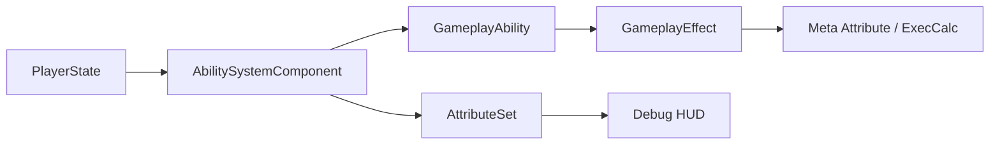
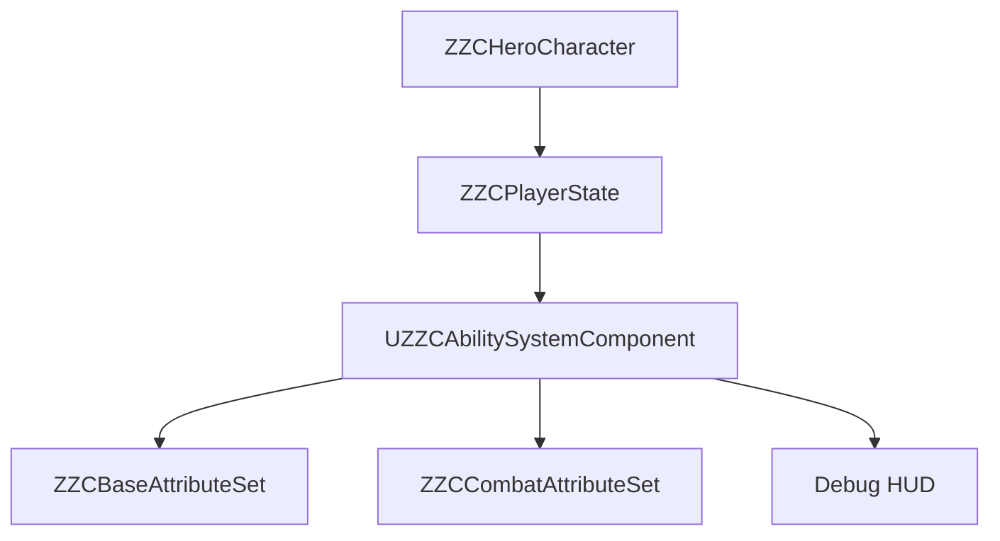
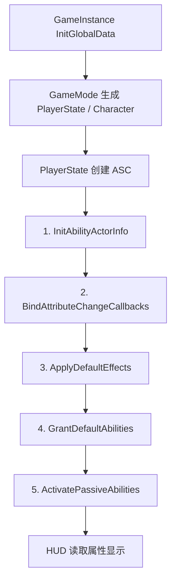
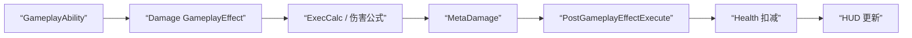

# ZZC Demo：GAS 核心接线

> **对应阶段：** Phase 2  
> **目标产出：** 完成 ASC 挂载、属性初始化、基础受伤流程和 Debug HUD 闭环。  
> **完成标准：** 双端 Health 同步正确，基础攻击 / 受伤可联机执行，HUD 数据可信。  
> **相关文档：** [3C系统](GAS-3C-Demo-01-3C系统.md) | [技能系统](GAS-3C-Demo-03-技能系统.md) | [网络预测](GAS-3C-Demo-05-网络预测.md)

---

## 本篇总览图



图解说明：
- Phase 2 的目标是把 GAS 主干接通，而不是马上把技能系统做复杂。
- `PlayerState -> ASC -> AttributeSet` 是最重要的宿主链。
- 只有主干接稳，Phase 3 的技能模板和 Phase 4 的预测验证才有意义。

---

## ASC 挂载关系图



图解说明：
- 这里明确推荐把 ASC 放在 `PlayerState`，而不是直接挂在 `Character`。
- `Character` 负责表现和动作，`PlayerState` 负责跨 Pawn 的持续玩法状态，职责更清晰。
- HUD 只读 ASC / Attribute，不成为数据源。

---

## 实现顺序

1. 在 `PlayerState` 上创建并初始化 ASC
2. 建立 `Character` 对 ASC 的访问桥
3. 完成 Base / Combat 两类 AttributeSet
4. 建立默认属性初始化流程
5. 打通受伤与 Meta Attribute 流程
6. 做基础 Debug HUD 和双端同步验证

---

## 一、为什么 ASC 放在 PlayerState

### 推荐原因

- 玩家重生、换 Pawn 或切表现层时，ASC 可以保持稳定宿主。
- 角色表现层和 GAS 数据层解耦，后续更利于扩展。
- 对多人联机来说，这个布局更接近成熟项目的思路。

### 什么时候 Character 挂 ASC 也可以

- 单机 Demo
- 不涉及重生 / 换体 / 持久化
- 只想快速演示最小能力

本 Demo 仍然推荐按 `PlayerState` 方案来做，因为后面技能、预测、面试表达都会更统一。

### 1A. PlayerState 创建 ASC

```cpp
// ZZCPlayerState.h
UCLASS()
class AZZCPlayerState : public APlayerState, public IAbilitySystemInterface
{
    GENERATED_BODY()

public:
    AZZCPlayerState();

    // IAbilitySystemInterface
    virtual UAbilitySystemComponent* GetAbilitySystemComponent() const override;

    UPROPERTY(VisibleAnywhere, BlueprintReadOnly, Category="GAS")
    TObjectPtr<UZZCAbilitySystemComponent> AbilitySystemComponent;

    UPROPERTY()
    TObjectPtr<UZZCBaseAttributeSet> BaseAttributeSet;

    UPROPERTY()
    TObjectPtr<UZZCCombatAttributeSet> CombatAttributeSet;
};
```

```cpp
// ZZCPlayerState.cpp
AZZCPlayerState::AZZCPlayerState()
{
    AbilitySystemComponent = CreateDefaultSubobject<UZZCAbilitySystemComponent>(TEXT("ASC"));
    AbilitySystemComponent->SetIsReplicated(true);
    AbilitySystemComponent->SetReplicationMode(EGameplayEffectReplicationMode::Mixed);

    // AttributeSet 作为子对象创建，ASC 会自动发现并注册
    BaseAttributeSet   = CreateDefaultSubobject<UZZCBaseAttributeSet>(TEXT("BaseAttributes"));
    CombatAttributeSet = CreateDefaultSubobject<UZZCCombatAttributeSet>(TEXT("CombatAttributes"));

    // PlayerState 的网络更新频率（默认较低，GAS 场景建议提高）
    NetUpdateFrequency = 100.0f;
}

UAbilitySystemComponent* AZZCPlayerState::GetAbilitySystemComponent() const
{
    return AbilitySystemComponent;
}
```

> **关键点**：
> - `SetReplicationMode(Mixed)`：对自己用 Full（所有 GE 都复制），对其他玩家用 Minimal（只复制 Tag 和 Cue）。这是联机场景的标准选择。
> - `IAbilitySystemInterface` 是 GAS 寻找 ASC 的标准接口，PlayerState 必须实现它。
> - AttributeSet 作为 `CreateDefaultSubobject` 创建后，ASC 会在初始化时自动注册它们，不需要手动调用注册函数。

### 1B. Character 对 ASC 的访问桥

```cpp
// ZZCCharacterBase.h
UCLASS()
class AZZCCharacterBase : public ACharacter, public IAbilitySystemInterface
{
    GENERATED_BODY()

public:
    virtual UAbilitySystemComponent* GetAbilitySystemComponent() const override;

    // ASC 初始化（服务端 + 客户端各调一次）
    virtual void PossessedBy(AController* NewController) override;        // 服务端
    virtual void OnRep_PlayerState() override;                            // 客户端

protected:
    // 缓存 ASC 指针，避免每次都从 PlayerState 查
    UPROPERTY()
    TWeakObjectPtr<UZZCAbilitySystemComponent> CachedASC;

    void InitializeASC();
};
```

```cpp
// ZZCCharacterBase.cpp
UAbilitySystemComponent* AZZCCharacterBase::GetAbilitySystemComponent() const
{
    return CachedASC.Get();
}

// 服务端：Pawn 被 Controller 控制时调用
void AZZCCharacterBase::PossessedBy(AController* NewController)
{
    Super::PossessedBy(NewController);
    InitializeASC();
}

// 客户端：PlayerState 复制到位后调用
void AZZCCharacterBase::OnRep_PlayerState()
{
    Super::OnRep_PlayerState();
    InitializeASC();
}

void AZZCCharacterBase::InitializeASC()
{
    if (AZZCPlayerState* PS = GetPlayerState<AZZCPlayerState>())
    {
        CachedASC = PS->AbilitySystemComponent;

        if (CachedASC.IsValid())
        {
            // 核心：告诉 ASC "Owner 是 PlayerState，Avatar 是这个 Character"
            CachedASC->InitAbilityActorInfo(PS, this);
        }
    }
}
```

> **为什么在两个地方都调 InitializeASC**：
> - **服务端**走 `PossessedBy`：此时 PlayerState 已就绪，可以直接初始化。
> - **客户端**走 `OnRep_PlayerState`：客户端的 PlayerState 是通过网络复制过来的，时机比 `PossessedBy` 晚，必须等复制完成后才能拿到 ASC。
> - 两个路径最终做的事情一样，只是触发时机不同。这是 GAS 联机项目的标准模式。

---

## 二、GAS 初始化流程



图解说明：
- 这张图把 Phase 0 和 Phase 2 的边界接起来了。
- `InitGlobalData()` 解决 GAS 全局数据；`InitAbilityActorInfo()` 解决具体玩家的 Ability Actor 绑定。
- 如果 HUD 没有值，优先回头查初始化链，而不是先怀疑 UI。

### ASC 5 步初始化流程（推荐）

参考 Lyra 的初始化模式，ASC 的初始化应遵循明确的 5 步顺序：

```cpp
void UZZCAbilitySystemComponent::InitializeWithPlayerState(APlayerState* InPlayerState)
{
    // 1. 基础初始化：建立 ActorInfo 关联
    InitAbilityActorInfo(InPlayerState, InPlayerState->GetPawn());

    // 2. 绑定属性变更回调：让 HUD、特效等系统能响应属性变化
    BindAttributeChangeCallbacks();

    // 3. 应用默认效果：初始属性值、被动 Buff 等
    ApplyDefaultEffects();

    // 4. 授予默认能力：从配置（DataAsset）加载角色拥有的技能
    GrantDefaultAbilities();

    // 5. 激活被动能力：自动启动被动监听类技能
    ActivatePassiveAbilities();
}
```

#### 顺序为什么重要

- 第 2 步必须在第 3 步之前：否则默认效果应用时回调还没注册，HUD 会丢失初始值通知。
- 第 3 步必须在第 4 步之前：有些技能的 CanActivate 依赖属性值已经就绪。
- 第 5 步必须在最后：被动技能可能需要查询前面步骤建立的状态。

---

## 三、AttributeSet 拆分

### 推荐拆分

| 类 | 职责 |
|------|------|
| `ZZCBaseAttributeSet` | Health、MaxHealth、MoveSpeed、Stamina 等通用属性 |
| `ZZCCombatAttributeSet` | Attack、Defense、Crit、MetaDamage 等战斗属性 |

### 为什么拆分

- 便于按职责组织属性
- 便于扩展非战斗角色
- 便于表达”哪些属性是运行结果，哪些属性是战斗输入”

### AttributeSet 复制策略

属性复制推荐使用 `ReplicatedUsing` + `OnRep` 回调，而非依赖默认复制：

```cpp
UCLASS()
class UZZCBaseAttributeSet : public UAttributeSet
{
    GENERATED_BODY()

public:
    UPROPERTY(BlueprintReadOnly, ReplicatedUsing=OnRep_Health, Category=”Attributes”)
    FGameplayAttributeData Health;

    UPROPERTY(BlueprintReadOnly, ReplicatedUsing=OnRep_MaxHealth, Category=”Attributes”)
    FGameplayAttributeData MaxHealth;

    UFUNCTION()
    virtual void OnRep_Health(const FGameplayAttributeData& OldValue);

    UFUNCTION()
    virtual void OnRep_MaxHealth(const FGameplayAttributeData& OldValue);
};
```

#### 为什么需要 OnRep

- `OnRep` 回调是属性变更通知的标准入口，HUD、特效、音效都应该从这里获得更新信号。
- 不使用 `OnRep` 时，客户端只能靠轮询发现属性变化，既浪费性能也容易遗漏。
- 这是 Lyra 和其他成熟 GAS 项目的标准做法。

### 3A. OnRep 回调与 GetLifetimeReplicatedProps 实现

```cpp
// ZZCBaseAttributeSet.cpp

void UZZCBaseAttributeSet::GetLifetimeReplicatedProps(
    TArray<FLifetimeProperty>& OutLifetimeProps) const
{
    Super::GetLifetimeReplicatedProps(OutLifetimeProps);

    DOREPLIFETIME_CONDITION_NOTIFY(UZZCBaseAttributeSet, Health,    COND_None, REPNOTIFY_Always);
    DOREPLIFETIME_CONDITION_NOTIFY(UZZCBaseAttributeSet, MaxHealth, COND_None, REPNOTIFY_Always);
}

void UZZCBaseAttributeSet::OnRep_Health(const FGameplayAttributeData& OldValue)
{
    // 这个宏做两件事：通知 ASC 属性已变更 + 更新内部预测缓存
    GAMEPLAYATTRIBUTE_REPNOTIFY(UZZCBaseAttributeSet, Health, OldValue);
}

void UZZCBaseAttributeSet::OnRep_MaxHealth(const FGameplayAttributeData& OldValue)
{
    GAMEPLAYATTRIBUTE_REPNOTIFY(UZZCBaseAttributeSet, MaxHealth, OldValue);
}
```

> **GAMEPLAYATTRIBUTE_REPNOTIFY** 是 GAS 提供的宏，内部会调用 `AbilitySystemComponent->SetBaseAttributeValueFromReplication()`。不要用自己的逻辑替代它，否则预测和回滚会出问题。

### 3B. PreAttributeChange 与 PostGameplayEffectExecute

```cpp
// ZZCBaseAttributeSet.cpp

// —— 属性值被修改前的拦截点（用于 Clamp）——
void UZZCBaseAttributeSet::PreAttributeChange(const FGameplayAttribute& Attribute, float& NewValue)
{
    Super::PreAttributeChange(Attribute, NewValue);

    // Health 不能超过 MaxHealth
    if (Attribute == GetHealthAttribute())
    {
        NewValue = FMath::Clamp(NewValue, 0.0f, GetMaxHealth());
    }
}

// —— GE 执行完毕后的收口点（Meta Attribute → 真实属性）——
void UZZCBaseAttributeSet::PostGameplayEffectExecute(
    const FGameplayEffectModCallbackData& Data)
{
    Super::PostGameplayEffectExecute(Data);

    // 从 CombatAttributeSet 的 MetaDamage 读取伤害，折算到 Health
    if (Data.EvaluatedData.Attribute == UZZCCombatAttributeSet::GetMetaDamageAttribute())
    {
        const float DamageDone = Data.EvaluatedData.Magnitude;
        if (DamageDone > 0.0f)
        {
            const float NewHealth = GetHealth() - DamageDone;
            SetHealth(FMath::Clamp(NewHealth, 0.0f, GetMaxHealth()));

            // 死亡判断
            if (GetHealth() <= 0.0f)
            {
                // 通过 GameplayEvent 通知死亡，不在 AttributeSet 里写死亡逻辑
                if (UAbilitySystemComponent* ASC = GetOwningAbilitySystemComponent())
                {
                    FGameplayEventData EventData;
                    EventData.EventTag = FGameplayTag::RequestGameplayTag(
                        FName("ZZC.Character.State.Dead"));
                    ASC->HandleGameplayEvent(EventData.EventTag, &EventData);
                }
            }
        }
    }
}
```

> **核心要点**：
> - `PreAttributeChange`：在值变更前做 Clamp，防止 Health 越界。注意这里 Clamp 的是"当前修改器的结果"，不是 GE 的最终输出。
> - `PostGameplayEffectExecute`：GE 执行完毕后的最终收口，在这里把 MetaDamage 折算到 Health。
> - 死亡不直接在 AttributeSet 里处理，而是发一个 GameplayEvent，让 Ability 或外部系统响应。这样死亡逻辑（播动画、禁用输入、通知 GameMode）可以在不同地方灵活实现。

---

## 四、伤害与 Meta Attribute 数据流



图解说明：
- `MetaDamage` 是过程数据，不是玩家长期持有的最终状态。
- 先算伤害，再在 `PostGameplayEffectExecute` 里把结果折算到真实属性上。
- 这种做法便于统一处理护甲减伤、暴击、吸血等战斗逻辑。

### 伤害评估数据结构

为了让伤害计算过程可追踪、可扩展，建议在 ExecCalc 中使用结构化的伤害评估数据：

```cpp
struct FZZCDamageEvaluation
{
    // 基础伤害输入
    float BaseDamage;
    float DamageMultiplier;        // 伤害乘数（技能倍率等）
    float CriticalMultiplier;      // 暴击乘数
    float ArmorReduction;          // 护甲减伤结果

    // 命中反馈信息
    bool bIsCritical;
    FGameplayTagContainer DamageTags;  // 伤害类型标签
    FVector HitLocation;               // 命中位置（用于伤害数字、特效）
    FVector HitDirection;              // 命中方向（用于击退、受击动画）
};
```

#### 为什么需要结构化伤害数据

- ExecCalc 的计算过程如果只靠零散的局部变量，后续很难扩展暴击、护甲、元素克制等规则。
- `HitLocation / HitDirection` 是命中反馈的必要信息，不应该在 ExecCalc 之外再单独查询。
- 这个结构只在伤害计算管线内流转，不作为持久化属性。

### 伤害类型标签化

伤害类型推荐用 GameplayTag 而非枚举：

```text
ZZC.Damage.Type.Physical
ZZC.Damage.Type.Magic
ZZC.Damage.Type.True        // 真实伤害（无视护甲）
```

治疗不属于伤害类型，应该走独立的 GE 路径，不要和伤害混在同一个枚举中。

### 为什么不用”直接改 Health”

- 直接改 `Health` 不利于统一插入公式、日志和扩展规则。
- 用 Meta Attribute 更容易保持”输入公式”和”落地结果”分离。

### 4A. ExecCalc 伤害计算实现

```cpp
// ZZCDamageExecCalc.h
UCLASS()
class UZZCDamageExecCalc : public UGameplayEffectExecutionCalculation
{
    GENERATED_BODY()

public:
    UZZCDamageExecCalc();

    virtual void Execute_Implementation(
        const FGameplayEffectCustomExecutionParameters& ExecutionParams,
        FGameplayEffectCustomExecutionOutput& OutExecutionOutput) const override;
};
```

```cpp
// ZZCDamageExecCalc.cpp

// —— 声明要捕获的属性 ——
struct FZZCDamageStatics
{
    DECLARE_ATTRIBUTE_CAPTUREDEF(Attack);    // 攻击方的 Attack
    DECLARE_ATTRIBUTE_CAPTUREDEF(Defense);   // 防御方的 Defense

    FZZCDamageStatics()
    {
        // Source = 攻击方，Target = 防御方
        DEFINE_ATTRIBUTE_CAPTUREDEF(UZZCCombatAttributeSet, Attack,  Source, false);
        DEFINE_ATTRIBUTE_CAPTUREDEF(UZZCCombatAttributeSet, Defense, Target, false);
    }
};

static const FZZCDamageStatics& DamageStatics()
{
    static FZZCDamageStatics Statics;
    return Statics;
}

UZZCDamageExecCalc::UZZCDamageExecCalc()
{
    // 告诉引擎这个 ExecCalc 需要捕获哪些属性
    RelevantAttributesToCapture.Add(DamageStatics().AttackDef);
    RelevantAttributesToCapture.Add(DamageStatics().DefenseDef);
}

void UZZCDamageExecCalc::Execute_Implementation(
    const FGameplayEffectCustomExecutionParameters& ExecutionParams,
    FGameplayEffectCustomExecutionOutput& OutExecutionOutput) const
{
    // 1. 捕获属性值
    float Attack  = 0.0f;
    float Defense = 0.0f;

    ExecutionParams.AttemptCalculateCapturedAttributeMagnitude(
        DamageStatics().AttackDef,  FAggregatorEvaluateParameters(), Attack);
    ExecutionParams.AttemptCalculateCapturedAttributeMagnitude(
        DamageStatics().DefenseDef, FAggregatorEvaluateParameters(), Defense);

    // 2. 伤害公式（简单版：Attack - Defense，最低为 1）
    const float FinalDamage = FMath::Max(Attack - Defense, 1.0f);

    // 3. 输出到 MetaDamage（不直接改 Health）
    OutExecutionOutput.AddOutputModifier(FGameplayModifierEvaluatedData(
        UZZCCombatAttributeSet::GetMetaDamageAttribute(),
        EGameplayModOp::Additive,
        FinalDamage));
}
```

> **设计说明**：
> - ExecCalc 通过 `DECLARE/DEFINE_ATTRIBUTE_CAPTUREDEF` 宏声明需要读取的属性，引擎会在执行时自动从 Source/Target ASC 上捕获值。
> - 输出写到 `MetaDamage` 而非 `Health`，后续在 `PostGameplayEffectExecute` 里折算。
> - 伤害公式故意保持简单（Attack - Defense），后续扩展暴击、元素等规则时修改这个函数即可。

---

## 四B、GameplayTag 层级设计

### 为什么需要提前规划 Tag 层级

- GameplayTag 贯穿 GAS 所有系统：技能激活条件、状态标记、伤害类型、冷却标识。
- 如果不做层级规划，后期会出现命名冲突、语义不清、查找困难等问题。
- Tag 层级应在 Phase 2 就确定，因为 Phase 3 的技能系统会大量依赖它。

### 推荐 Tag 层级（精简版）

```text
ZZC.
├── Character.State          // 角色状态
│   ├── Alive
│   ├── Dead
│   ├── Stunned
│   └── Frozen
├── Character.Movement       // 移动状态
│   ├── Sprinting
│   ├── Crouching
│   └── Airborne
├── Ability.Type             // 技能类型
│   ├── Melee
│   ├── Ranged
│   └── Utility
├── Ability.Combat           // 战斗行为
│   ├── Offensive
│   └── Defensive
├── Damage.Type              // 伤害类型
│   ├── Physical
│   ├── Magic
│   └── True
└── Damage.Critical          // 暴击标记
```

### 精简原则

- 只保留 Demo 会用到的分支：`Character.State`、`Character.Movement`、`Ability.Type`、`Ability.Combat`、`Damage.Type`。
- 不预留元素系统（Fire/Ice/Lightning）—— Demo 不做元素反应，加了只是噪声。
- 不预留装备/天赋等分支 —— 需要时再扩展，Tag 系统天然支持动态添加。

### 注册方式

推荐使用 `DefaultGameplayTags.ini` 或 `GameplayTagsManager` 在启动时批量注册，不要在各个类里零散定义。

---

## 五、Buff 三层结构

### 推荐划分

| 层级 | 作用 |
|------|------|
| `GameplayEffect` | 数值变化与时长定义 |
| `AbilitySystemComponent` | 施加、移除、查询状态 |
| `外层表现层` | UI、特效、图标、提示 |

### 设计原则

- Buff 逻辑归 GAS，表现归表现层。
- 不要把“Buff 是否存在”的权威状态写在 HUD 或 Widget 里。

---

## 六、基础调试与 HUD

### HUD 最低要求

- 显示 `Health / MaxHealth`
- 显示 `Stamina`
- 显示关键 Tag 或 Buff 状态（可选）

### HUD 数据来源

- 推荐只从 ASC / AttributeSet 读取
- 不要在 HUD 内部缓存一份”自己的生命值”

### 6A. 从 Character 获取 ASC 并监听属性变化

```cpp
// 示例：在 HUD Widget 初始化时绑定属性变化
void UZZCHealthWidget::BindToASC(UAbilitySystemComponent* ASC)
{
    if (!ASC) return;

    // 通过 ASC 的 Delegate 监听 Health 变化
    ASC->GetGameplayAttributeValueChangeDelegate(
        UZZCBaseAttributeSet::GetHealthAttribute())
        .AddUObject(this, &ThisClass::OnHealthChanged);

    ASC->GetGameplayAttributeValueChangeDelegate(
        UZZCBaseAttributeSet::GetMaxHealthAttribute())
        .AddUObject(this, &ThisClass::OnMaxHealthChanged);

    // 读取初始值
    bool bFound = false;
    float CurrentHealth = ASC->GetGameplayAttributeValue(
        UZZCBaseAttributeSet::GetHealthAttribute(), bFound);
    if (bFound) UpdateHealthDisplay(CurrentHealth);
}

void UZZCHealthWidget::OnHealthChanged(const FOnAttributeChangeData& Data)
{
    UpdateHealthDisplay(Data.NewValue);
}
```

> **关键点**：使用 `GetGameplayAttributeValueChangeDelegate` 而不是轮询。这样只在属性真正变化时才更新 UI，性能更好、时序更可靠。

---

## 验收标准

### 通过标准

- [ ] ASC 初始化遵循 5 步流程，顺序正确
- [ ] AttributeSet 使用 ReplicatedUsing + OnRep 回调
- [ ] GameplayTag 层级已在配置文件中注册
- [ ] 角色创建后默认属性已正确初始化
- [ ] 对角色施加伤害时，Health 在服务端和客户端表现一致
- [ ] HUD 读到的 Health 和真实属性一致
- [ ] 基础攻击 / 受伤链路可联机执行

### 操作建议

1. 双人 PIE 进入测试场景
2. 让一个角色触发基础攻击或测试伤害逻辑
3. 观察服务端、本地客户端、远端客户端上的生命值变化
4. 确认 HUD 与实际血量一致

---

## 常见问题

### Q1：HUD 读不到属性

优先查：
- ASC 是否已初始化
- `InitAbilityActorInfo()` 是否正确调用
- HUD 绑定的是 `Character` 上的什么对象，而不是误绑到空指针

### Q2：伤害逻辑执行了，但血量没变化

优先查：
- 是不是只写了 `MetaDamage`，没有在 `PostGameplayEffectExecute` 中折算到 `Health`
- GE 是否真的作用到目标 ASC

### Q3：为什么 Demo 现在就要做 ExecCalc

原因：
- 它是后续技能系统和网络验证的数据入口。
- 先把伤害公式入口放好，后面能力扩展更顺。

---

## 设计决策

| 决策 | 选择 | 为什么这样做 | 备选方案 | Demo 为什么不选备选 |
|------|------|-------------|----------|--------------------|
| ASC 宿主 | PlayerState | 适合联机与持久状态 | Character | 对重生 / 换体扩展不友好 |
| AttributeSet 拆分 | Base + Combat | 职责明确 | 一个大 AttributeSet | 后续维护会越来越乱 |
| 伤害落地方式 | Meta Attribute | 公式和结果分离 | 直接改 Health | 不利于扩展复杂伤害规则 |
| HUD 数据源 | 只读 ASC | 权威数据单一 | HUD 自己缓存状态 | 容易出现显示与真实状态不一致 |

---

## 参考资料

- GAS 官方文档
- tranek GASDocumentation
- Lyra Starter Game 的 GAS 组织方式
