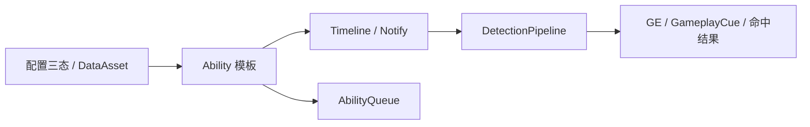
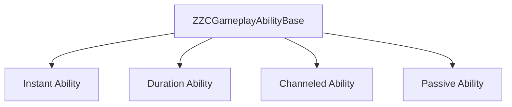
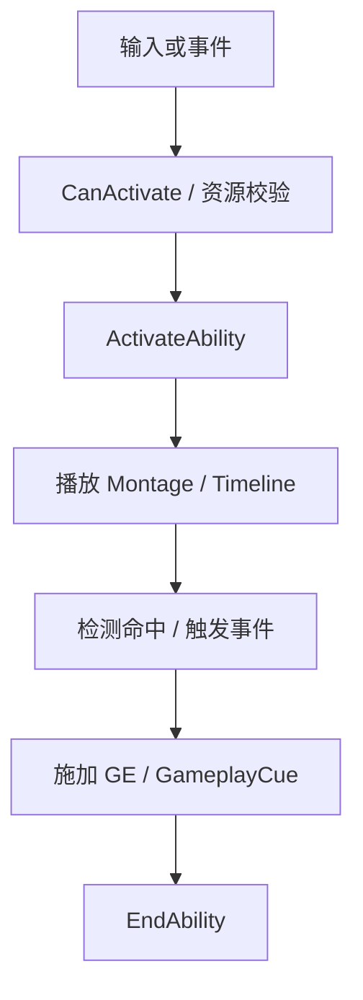
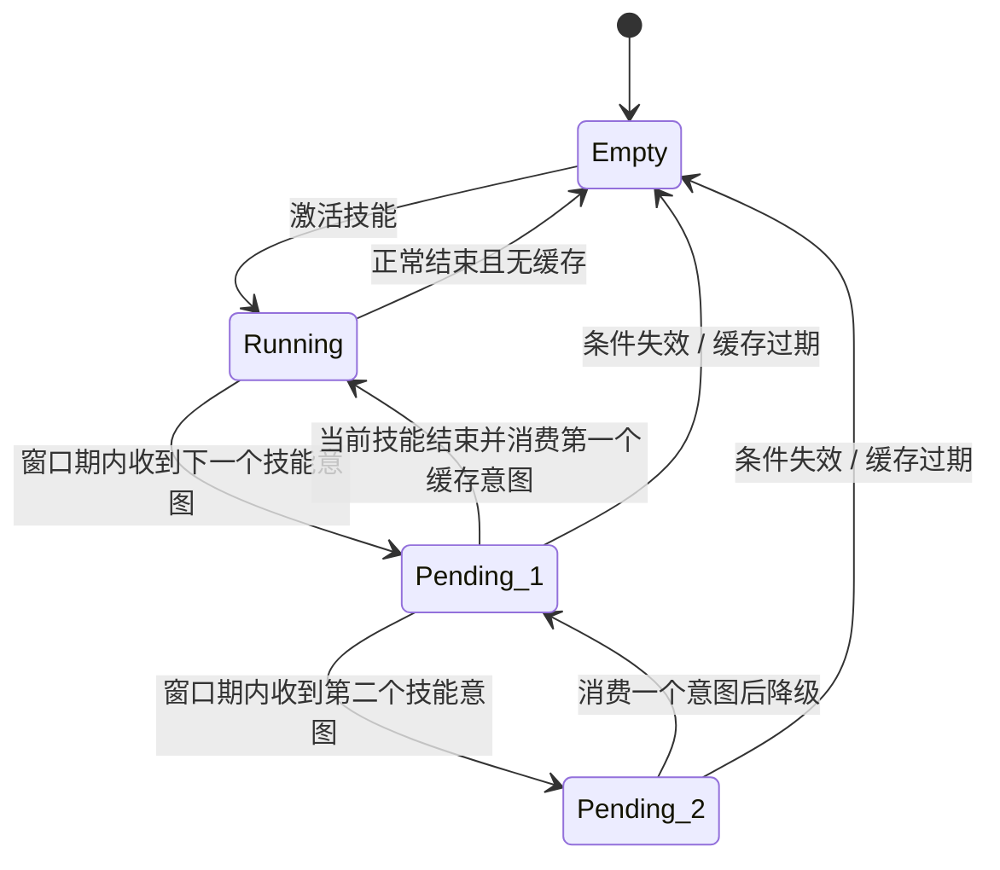
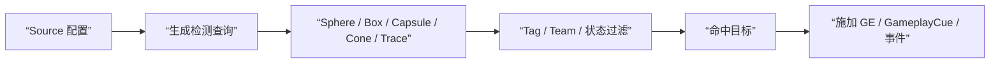

# ZZC Demo：技能系统

> **对应阶段：** Phase 3  
> **目标产出：** 建立技能配置三态、4 种 Ability 模板、基础 Timeline/Queue/DetectionPipeline 主链。  
> **完成标准：** 技能可从配置进入运行时，关键流程可解释，MVP 技能样例可运行。  
> **相关文档：** [GAS核心](GAS-3C-Demo-02-GAS核心.md) | [编辑器](GAS-3C-Demo-04-编辑器.md) | [网络预测](GAS-3C-Demo-05-网络预测.md)

---

## 本篇总览图



图解说明：
- 这篇的重点是把“配置如何进入运行时”讲清楚，而不是一口气做完所有技能案例。
- 配置层、执行层、检测层要分清，否则技能一复杂就会失控。
- 编辑器是配置层的放大器，不是技能运行时的替代品。

---

## 技能模板分类图



图解说明：
- 所有技能先经过统一基类，再按持续方式分成 4 种模板。
- 这比“每个技能都从 `UGameplayAbility` 直接开写”更利于维护。
- 模板的意义是收束共性，不是为了做继承层级秀肌肉。

---

## 实现顺序

1. 先把配置三态定义清楚
2. 实现 `ZZCGameplayAbilityBase` 和四种模板
3. 补齐技能执行主流程
4. 再接 AbilityQueue 与 DetectionPipeline
5. 最后做技能案例和编辑器对接

---

## 一、配置三态

### 推荐三态

| 配置层 | 作用 |
|------|------|
| `AbilitySet` | 定义角色拥有哪些技能 |
| `AbilityConfig` | 定义单个技能的特有参数 |
| `AbilityPriority` | 定义技能关系、冲突、优先级 |

### 为什么要分三态

- 角色“带什么技能”与“技能长什么样”不是同一个问题。
- 技能优先级和关系通常是横切配置，硬塞进某个技能里会很乱。
- 这套分层也更利于后续编辑器可视化。

---

## 二、技能执行主流程



图解说明：
- 这是技能执行的最小主干，不区分具体模板。
- `Gate` 负责资格检查，`Timeline` 负责时序推进，`Detection` 负责命中判定。
- 一旦把这些职责混写在一起，技能越多越难维护。

---

## 三、Ability Queue 状态图



图解说明：
- Queue 缓存的是”意图”，不是整段技能运行时数据。
- 推荐队列深度为 2（最多缓存 2 个后续意图），相比深度 1 能显著改善连招手感。
- 超过深度 2 的意图直接丢弃，避免产生”按了一堆键后角色自动执行一长串动作”的失控行为。
- 服务端是否感知 Queue 是设计选择，本 Demo 默认先做本地意图缓冲。

### Queue 配置建议

```cpp
// 队列核心参数
float GlobalQueueWindow = 0.2f;   // 全局队列窗口（秒）
int32 MaxQueueDepth = 2;          // 最大队列深度
```

- `GlobalQueueWindow`：在当前技能结束前多少秒内接受下一个输入意图。0.2s 是普遍 ARPG 的舒适值。
- 不需要优先级系统 —— 对 Demo 来说 FIFO（先进先出）已经足够。

---

## 四、DetectionPipeline 数据流图



图解说明：
- DetectionPipeline 解决的是”命中判定逻辑不要散落在每个技能里”。
- 本 Demo 推荐先做 `Source` 侧配置，不急着把 Target 侧规则系统做满。
- 先让检测管线足够统一，后面扩到弹道、召唤物和复杂目标过滤会轻松很多。

### 检测形状配置

```cpp
enum class EZZCDetectionShape
{
    Sphere,        // 球形（范围 AOE）
    Box,           // 盒型（矩形区域）
    Capsule,       // 胶囊（角色碰撞体常用）
    Cone,          // 锥形（近战横扫、扇形技能）
    SingleTrace,   // 单线（射线类技能）
};

struct FZZCDetectionConfig
{
    EZZCDetectionShape Shape;

    // 形状参数
    float Radius;           // Sphere / Cone 半径
    FVector BoxExtent;      // Box 半范围
    float ConeAngle;        // Cone 角度（度）
    float ConeLength;       // Cone 长度

    // 过滤条件
    FGameplayTagQuery TargetTagQuery;   // 目标必须满足的 Tag 条件
    FGameplayTagQuery IgnoreTagQuery;   // 满足此条件的目标被忽略

    // 命中规则
    bool bIgnoreSelf;                   // 忽略自身
    bool bAllowMultipleHits;            // 允许多目标命中
};
```

### 为什么新增 Cone 检测

- 近战横扫是 ARPG 最常见的技能形态，仅靠 Sphere 需要额外的角度过滤代码。
- Cone 检测可以用 `ConeAngle + ConeLength` 直接配置，比手写三角函数过滤更直观。
- 配合 Tag 过滤，可以实现”只命中前方敌方单位”等常见需求。

### Tag 过滤说明

- `TargetTagQuery`：例如 `ZZC.Character.State.Alive`，确保只命中活着的目标。
- `IgnoreTagQuery`：例如 `ZZC.Character.State.Invincible`，跳过无敌状态的目标。
- 使用 `FGameplayTagQuery` 而非简单的 Tag 容器，支持 AND/OR/NOT 组合条件。

---

## 五、MVP 技能范围

### 推荐先做的样例

| 样例 | 模板 | 价值 |
|------|------|------|
| 普通攻击连招 | Duration | 验证 Timeline 与 Queue |
| Sprint 体力消耗 | Channel / Duration | 验证持续效果与状态变化 |
| 闪避 / 翻滚 | Duration | 验证动作窗口与无敌帧表达 |
| 被动触发 | Passive | 验证自动监听与状态更新 |

### 暂不作为主线阻塞项

- 复杂召唤物
- 变身系统
- 多层目标侧规则系统
- 大量元素反应与复杂连锁特效

---

## 六、与编辑器的边界

### 本篇关注

- 配置结构如何设计
- 运行时如何读取这些配置
- 哪些字段需要可视化编辑

### 不在本篇展开

- Slate 编辑器窗口生命周期
- AssetTypeActions 注册细节
- 复杂 Preview 视图

这些内容统一放到 [编辑器](GAS-3C-Demo-04-编辑器.md)。

---

## 验收标准

- [ ] 4 种 Ability 模板可在蓝图中继续派生
- [ ] 技能配置三态能清晰落到具体数据结构
- [ ] 至少 2 个 MVP 技能样例可跑通
- [ ] AbilityQueue 深度为 2，能正确缓存并按 FIFO 消费技能意图
- [ ] DetectionPipeline 支持 Cone 检测形状
- [ ] DetectionPipeline 支持 GameplayTag 过滤（TargetTagQuery / IgnoreTagQuery）

### 建议验证流程

1. 先验证一个即时或时长技能能正常激活
2. 再验证一个带时序推进的技能
3. 再打开 Queue，验证意图缓存是否正确
4. 最后再把检测管线、GameplayCue 和编辑器串起来

---

## 常见问题

### Q1：为什么不是每个技能都单独硬编码

因为 Phase 3 的目标是建立体系，不是一次性做几个能跑的技能脚本。

### Q2：Queue 一定要服务端感知吗

不一定。

本 Demo 默认：
- Queue 先作为客户端输入意图缓冲
- 先保证体验和结构正确
- 更重的服务端协调策略作为增强项

### Q3：DetectionPipeline 为什么先只做 Source 侧

原因：
- Demo 规模下，Target 侧规则系统容易引入额外复杂度
- 先把统一查询、过滤、命中结果走通更重要

---

## 设计决策

| 决策 | 选择 | 为什么这样做 | 备选方案 | Demo 为什么不选备选 |
|------|------|-------------|----------|--------------------|
| 技能模板 | 4 类统一模板 | 收束共性，方便复用 | 技能各写各的 | 扩展后会快速失控 |
| 配置分层 | 三态配置 | 数据职责清晰 | 全塞一个 DataAsset | 编辑器和运行时都难维护 |
| Queue 深度 | 深度 2 | 改善连招手感，FIFO 足够 | 做复杂优先级队列 | 增加行为不确定性 |
| Detection 范围 | 先做 Source 侧 + Cone + Tag 过滤 | 覆盖主流 Demo 场景 | 同时做 Source + Target 全量规则 | 对 Demo 过重 |

---

## 参考资料

- GAS 官方文档
- Action Game / Lyra 中的 Ability 模式参考
- tranek GASDocumentation
