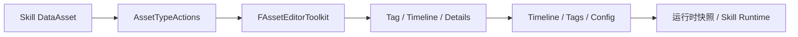
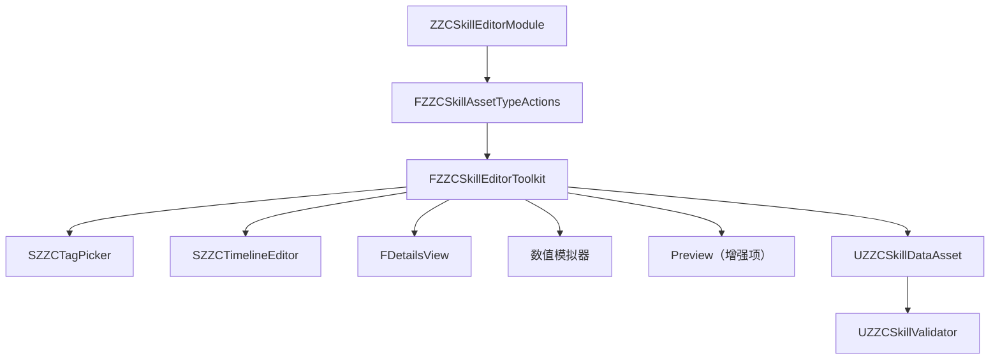
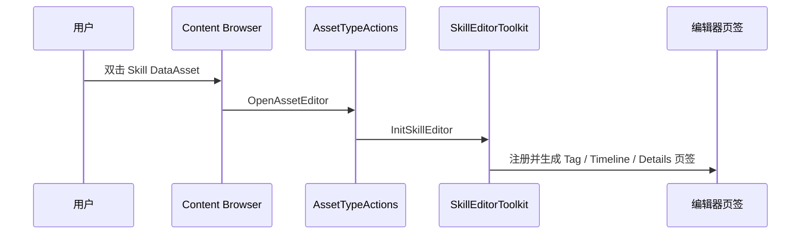
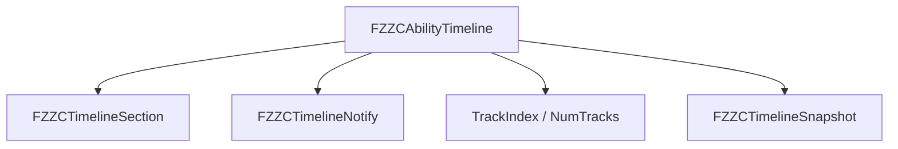
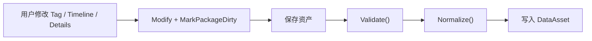
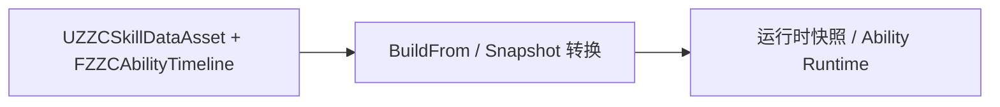

# ZZC Demo：技能编辑器（Slate 插件）

> **对应阶段：** Phase 3  
> **目标产出：** 双击技能 DataAsset 打开自定义编辑器，支持 Tag 选择、Details 编辑、Timeline 数据可视化。  
> **完成标准：** 插件可加载，DataAsset 可打开并保存，核心数据结构与运行时边界明确。  
> **相关文档：** [技能系统](GAS-3C-Demo-03-技能系统.md) | [源码扩展分级](GAS-3C-Demo-06-源码扩展分级.md)

---

## 本篇总览图



图解说明：
- 这篇强调的是“编辑器只是配置入口”，不是把运行时逻辑搬进 Slate。
- 先做可打开、可编辑、可保存的 MVP，再考虑复杂 Preview 和拖拽体验。
- 文档里统一把“编辑器态数据”和“运行时快照”明确分开，避免边界模糊。

---

## 插件模块架构图



图解说明：
- `AssetTypeActions` 解决“怎么打开”，`Toolkit` 解决“打开后怎么组织窗口”。
- `Tag / Timeline / Details` 是 MVP 必做页签；`Preview` 明确标成增强项，避免和最小目标混淆。
- 这样能避免文档里出现“图画了 Preview，但代码示例根本没实现”的口径错位。

---

## 实现顺序

1. 创建 Editor Plugin 与模块依赖
2. 注册 `FZZCSkillAssetTypeActions`
3. 搭出 `FZZCSkillEditorToolkit` 基础窗口
4. 接入 `SGameplayTagWidget` 与 `FDetailsView`
5. 定义 Timeline 数据结构与保存校验
6. 再考虑可视化 Timeline 和 Preview 增强项

---

## 一、MVP 范围与增强项边界

### MVP 必做

| 功能 | 说明 |
|------|------|
| 双击 DataAsset 打开编辑器 | 完整入口链 |
| Tag 树选择 | 复用 `SGameplayTagWidget` |
| Details 编辑 | 编辑普通 UPROPERTY |
| 保存持久化 | 关闭重开后数据不丢 |
| Timeline 数据结构 | 至少能在 Details 中编辑 |

### 增强项

| 功能 | 原因 |
|------|------|
| 可拖拽 Timeline 轨道 | 交互复杂度高 |
| Preview 视口 | 依赖更多 Persona / PreviewScene 接入 |
| Graph 视图切换 | 不是 MVP 阻塞项 |
| 技能流程图 | 可视化技能执行流程，展示编辑器扩展能力 |

### 推荐增强（低成本高价值）

| 功能 | 说明 | 复杂度 |
|------|------|--------|
| 数值模拟器 | 在编辑器中输入攻防数值，模拟伤害/治疗结果 | 低 |
| 数据验证系统 | 保存前自动检查配置合法性，输出 Errors/Warnings/Suggestions | 低 |

---

## 一B、数据验证系统

### 为什么需要

- 技能配置参数多、关联复杂，手动检查容易遗漏。
- 一个带分级反馈（Error / Warning / Suggestion）的验证系统，能在编辑器中立即暴露配置问题。
- 实现成本低，但对整体编辑体验提升很大。

### 推荐结构

```cpp
struct FZZCSkillValidationResult
{
    bool bIsValid;
    TArray<FString> Errors;       // 阻塞保存的严重问题
    TArray<FString> Warnings;     // 不阻塞但应关注的问题
    TArray<FString> Suggestions;  // 可选的改进建议
};

class UZZCSkillValidator
{
public:
    FZZCSkillValidationResult ValidateSkill(const UZZCSkillDataAsset* Asset);

    // 具体验证项
    bool ValidateDamageValues(const FZZCDamageConfig& Config);    // 伤害数值合理性
    bool ValidateCooldown(float Cooldown);                        // 冷却时间 > 0
    bool ValidateTimeline(const FZZCAbilityTimeline& Timeline);   // Section 不重叠
    bool ValidateTagRequirements(const FGameplayTagContainer& Tags); // 必要 Tag 是否存在
};
```

### 集成位置

- 在 `Validate()` 步骤中调用（即保存前的 `Validate + Normalize` 链路）。
- 如果有 Error，阻止保存并在编辑器中用红色消息提示。
- Warning 和 Suggestion 显示在编辑器底部或 Output Log 中。

---

## 一C、数值模拟器

### 为什么低成本高价值

- 不需要运行游戏就能验证伤害公式是否合理。
- 本质上只是读取 DataAsset 中的配置 + 套用 ExecCalc 相同的公式 + 输出结果。
- 可以做成编辑器页签中的一个简单面板。

### 推荐交互

1. 在编辑器中提供"攻击方属性"和"防御方属性"的输入框
2. 点击"模拟"按钮，用当前 DataAsset 的配置计算伤害
3. 显示：基础伤害、暴击伤害、护甲减伤后伤害、最终伤害

### 注意事项

- 模拟器使用的公式必须和运行时 ExecCalc 保持一致，建议抽取公共计算函数。
- 模拟器是 Editor-only 工具，不进入运行时模块。

---

## 二、资产打开流程图



图解说明：
- 这条链路要先打通，再谈页签内容丰富度。
- 文档里所有代码示例都应围绕这条主链展开，不在不同段落里给出相互矛盾的入口方式。

---

## 三、Timeline 数据结构图



图解说明：
- 编辑器态数据负责“可编辑、可保存、可排序”；运行时快照负责“可高效读取”。
- `Validate()` 和 `Normalize()` 的目标是保证存盘前数据合法，不是替代运行时判错。
- 这是文档里要讲清的边界，不然实现时容易把编辑器职责和运行时职责混写。

### 推荐约束

- `SectionId / NotifyId` 作为稳定 ID，方便 Undo / Redo 与选中状态保持
- `TrackIndex` 显式归属轨道
- 保存前统一排序与合法性校验

---

## 四、保存与生命周期钩子

### 必须显式交代的保存链



图解说明：
- 这张图补的是之前最容易缺的“保存在哪里收口”。
- 仅调用 `MarkPackageDirty()` 只表示“资产已脏”，并不等于“已做合法性整理”。
- 文档统一要求：保存前必须走 `Validate + Normalize`，并说明挂接点在编辑器保存流程或资产保存回调中。

### 建议写法

- 字段变更时：`Modify()` + `MarkPackageDirty()`
- 统一保存前：执行 `Validate()` 与 `Normalize()`
- 保存失败时：给出明确报错，而不是悄悄吞掉

---

## 五、编辑器态与运行时态分离



图解说明：
- 运行时不应依赖复杂的编辑器对象树。
- 编辑器数据可以更可读、更利于交互；运行时快照可以更扁平、更高效。
- 这样也更利于后续把编辑器模块完全隔离在 Editor-only 插件中。

---

## 六、模块依赖与边界

### MVP 依赖

| 模块 | 用途 |
|------|------|
| `AssetTools` | 注册资产打开方式 |
| `Slate / SlateCore` | 自定义编辑器 UI |
| `PropertyEditor` | `FDetailsView` |
| `GameplayTagsEditor` | `SGameplayTagWidget` |

### 边界说明

- `GameplayTagsEditor`、PreviewScene 等依赖都属于 Editor-only。
- 文档里必须明确这些内容不进入游戏运行时模块。

---

## 验收标准

- [ ] 插件可在编辑器启动时正常加载
- [ ] 双击 Skill DataAsset 能打开自定义编辑器
- [ ] Tag 选择可修改并持久化
- [ ] Details 中普通字段可编辑并保存
- [ ] Timeline 数据结构至少可在 Details 中编辑并在保存时被整理
- [ ] 数据验证系统可在保存前输出 Errors / Warnings / Suggestions
- [ ] 数值模拟器可在编辑器中模拟伤害计算结果
- [ ] 文档明确：Preview 是增强项，不是 MVP 阻塞项

---

## 常见问题

### Q1：为什么不直接用默认 Details 面板

因为：
- Tag 树和 Timeline 需要更强的表达能力
- 默认 Details 适合作为一部分，不适合作为整套技能编辑体验

### Q2：`SGameplayTagWidget` 能直接复用吗

可以，但必须明确：
- 这是 Editor-only 依赖
- 模块依赖要加在编辑器插件而不是运行时模块里

### Q3：Preview 要不要现在就做

建议：
- 文档和实现都统一按“增强项”处理
- 先把打开、编辑、保存的主链做通

---

## 设计决策

| 决策 | 选择 | 为什么这样做 | 备选方案 | Demo 为什么不选备选 |
|------|------|-------------|----------|--------------------|
| 编辑器技术路线 | Slate + Toolkit | 可控性最高 | 纯 Details 面板 | 很难承载 Tag 树与 Timeline |
| Preview 范围 | 增强项 | 降低 MVP 风险 | 一开始全做 | 会拖慢主链交付 |
| 保存收口 | 统一 Validate + Normalize | 数据口径稳定 | 到处零散处理 | 很难保证一致性 |
| 数据边界 | 编辑器态 / 运行时态分离 | 结构清晰 | 直接运行时读取编辑器结构 | 不利于性能和模块隔离 |

---

## 参考资料

- Slate 官方文档
- FAssetEditorToolkit 官方文档
- Gameplay Tags Editor 相关 API
