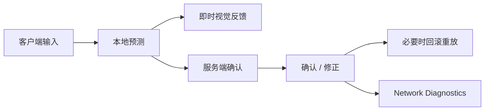
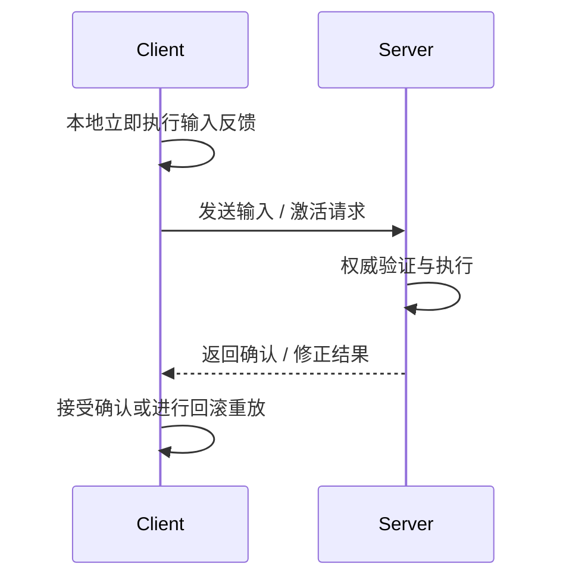
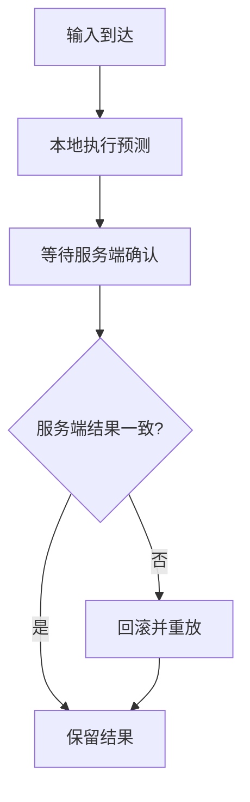
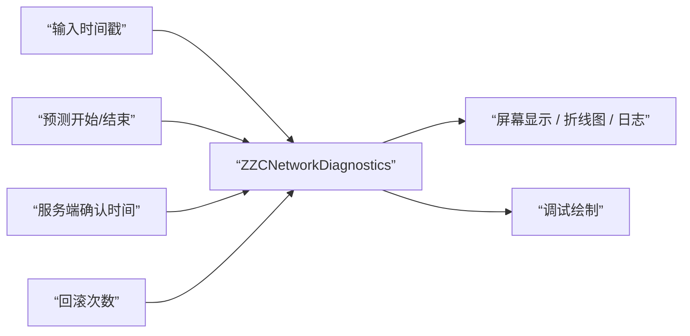

# ZZC Demo：网络预测与诊断

> **对应阶段：** Phase 4  
> **目标产出：** 在延迟环境下验证移动与技能预测链是否正确，并提供可视化诊断手段。  
> **完成标准：** `200ms` 左右延迟下，关键能力的本地反馈、服务端确认和回滚路径可观察、可解释。  
> **相关文档：** [3C系统](GAS-3C-Demo-01-3C系统.md) | [GAS核心](GAS-3C-Demo-02-GAS核心.md) | [技能系统](GAS-3C-Demo-03-技能系统.md)

---

## 本篇总览图



图解说明：
- 预测不是“假装成功”，而是先本地执行，再等待服务端确认。
- Phase 4 主要验证前面做的预测是否正确，而不是从零开始添加预测。
- 诊断工具的价值在于把“感觉怪”变成“哪个阶段的延迟或修正有问题”。

---

## 客户端预测时序图



图解说明：
- 这是移动和技能都适用的通用预测骨架。
- 真正需要关注的是“本地先做了什么”和“确认回来后怎么收口”。
- 如果本地和服务端计算规则不同，回滚就会变多，体验就会变差。

---

## 预测与回滚流程图



图解说明：
- 预测系统的关键不只是“快”，还包括“错了能不能收回来”。
- 回滚越频繁，说明本地和服务端状态差异越大。
- 所以 Phase 4 的核心不是追求零回滚，而是把回滚控制在可接受范围并能解释来源。

---

## 一、验证范围

### 必测项目

| 类别 | 关注点 |
|------|--------|
| 移动预测 | Sprint 是否平滑，无明显拉扯 |
| 技能预测 | 本地激活是否及时，确认后是否稳定 |
| HUD / 诊断 | 能否看见预测窗口、确认延迟、回滚次数 |

### 默认不强求

- 每一种技能都做到完美本地预测
- 高复杂弹道和高级服务器补偿
- 大世界复制图优化

---

## 二、操作路径与观察项

### 推荐延迟验证流程

1. 双人 PIE 打开 `L_TestArena`
2. 在网络模拟中设置约 `PktLag=200`
3. 重复做 Sprint、基础攻击、一个带时长的技能
4. 同时观察：
   - 本地输入到视觉反馈的时间
   - 服务端确认后的抖动或拉回
   - 远端玩家看到的表现是否合理

### 通过标准

- 本地玩家操作后能立即获得合理反馈
- 服务端确认回来后没有严重瞬移或状态错乱
- 预测失败时可以通过诊断数据解释原因，而不是只能凭感觉猜

---

## 三、预测分类建议

| 类型 | 建议策略 | 原因 |
|------|----------|------|
| 角色移动 | 必做预测 | 直接决定基础手感 |
| 即时技能激活 | 尽量本地预测 | 避免按键后明显延迟 |
| 复杂生成物 / 高风险行为 | 允许保守处理 | 先保正确性 |

---

## 四、诊断工具数据流图



图解说明：
- 诊断工具的核心不是炫酷图形，而是把关键信号收集齐。
- 最少要能看见输入、预测、确认、回滚四类信号。
- 这样后续讨论”为什么这个技能手感差”时才有共同证据。

### 诊断数据结构

```cpp
struct FZZCNetworkMetrics
{
    // 时序数据
    double InputTimestamp;           // 输入发生时间
    double PredictionTimestamp;      // 本地预测执行时间
    double ServerConfirmTimestamp;   // 服务端确认到达时间

    // 网络质量
    float RTT;                      // 往返时间（ms）
    float Jitter;                   // 抖动（ms）
    int32 PacketsLost;              // 丢包数

    // 预测质量
    int32 PredictionKey;            // 预测键
    bool bWasRolledBack;            // 是否被回滚
    FVector PredictedPosition;      // 预测位置
    FVector CorrectedPosition;      // 服务端修正位置
    float PositionError;            // 位置误差（单位：cm）
};
```

### 诊断工具接口

```cpp
class UZZCNetworkDiagnostics : public UObject
{
public:
    // 记录关键时间点
    void RecordInput(const FVector& Position);
    void RecordPrediction(uint32 PredictionKey, const FVector& Position);
    void RecordServerConfirm(uint32 PredictionKey, const FVector& ServerPosition);
    void RecordRollback(uint32 PredictionKey);

    // 统计查询
    float GetAveragePositionError() const;
    int32 GetTotalRollbacksThisSession() const;
    float GetAverageRTT() const;

    // 显示
    void DrawDebugHUD(UCanvas* Canvas);

private:
    TMap<uint32, FZZCNetworkMetrics> MetricsHistory;
};
```

### 预测回滚可视化

在调试模式下，使用 DrawDebug 函数将预测过程可视化：

```cpp
// 调试绘制颜色约定
// 绿色球体 = 客户端预测位置
// 红色球体 = 服务端确认位置
// 黄色连线 = 回滚修正轨迹（预测位置 → 修正位置）

void UZZCNetworkDiagnostics::DrawDebugVisualization()
{
    for (const auto& [Key, Metrics] : MetricsHistory)
    {
        // 绘制预测位置（绿色）
        DrawDebugSphere(World, Metrics.PredictedPosition, 5.0f, 8, FColor::Green);

        // 绘制服务端确认位置（红色）
        DrawDebugSphere(World, Metrics.CorrectedPosition, 5.0f, 8, FColor::Red);

        // 如果发生了回滚，绘制修正轨迹（黄色）
        if (Metrics.bWasRolledBack)
        {
            DrawDebugLine(World, Metrics.PredictedPosition,
                Metrics.CorrectedPosition, FColor::Yellow);
        }
    }
}
```

#### 可视化的调试价值

- 绿色和红色球体重合 = 预测准确，无回滚。
- 黄色线越长 = 预测偏差越大，需要排查本地与服务端计算不一致的原因。
- 搭配 HUD 上的 RTT / PositionError 数值，可以快速定位问题是网络质量还是逻辑偏差。

---

## 五、常见预测失败模式

| 现象 | 典型原因 |
|------|----------|
| Sprint 抖动 | SavedMove 未记录关键状态 |
| 技能先放后撤回 | 本地预测与服务端资格校验不一致 |
| 远端看到表现奇怪 | 本地只做了视觉反馈，缺少统一复制或 Cue |
| HUD 看起来对不上 | 诊断数据源与真实运行时数据源不一致 |

---

## 验收标准

- [ ] `200ms` 左右延迟环境已能稳定复现
- [ ] Sprint 在延迟下仍然可接受
- [ ] 至少 1 个本地预测技能可验证完整链路
- [ ] 诊断工具能显示输入、确认、回滚等关键信号（RTT / PositionError / RollbackCount）
- [ ] 回滚可视化可在调试模式下绘制预测位置（绿）、服务端位置（红）、修正轨迹（黄）
- [ ] 能用文档里的图和日志解释预测问题来源

---

## 常见问题

### Q1：是不是 Phase 4 才开始加预测

不是。

Phase 1 的 Sprint、Phase 2/3 的 Ability 激活，本质上都已经在决定预测链是否正确。  
Phase 4 是把它们集中拉到延迟环境里验证和诊断。

### Q2：回滚是不是就代表实现失败

不是。

关键看：
- 是否频率过高
- 是否幅度过大
- 是否能解释来源

### Q3：为什么先做诊断再做更复杂的预测优化

因为没有可观测性，就很难判断是“逻辑错了”还是“体验参数不合适”。

---

## 设计决策

| 决策 | 选择 | 为什么这样做 | 备选方案 | Demo 为什么不选备选 |
|------|------|-------------|----------|--------------------|
| 验证重点 | 先测主链 | 先保证关键能力可信 | 一上来覆盖所有技能 | 成本过高 |
| 延迟环境 | 200ms 级别验证 | 足够暴露常见问题 | 只在本地零延迟测 | 看不出预测价值 |
| 诊断形态 | HUD + 日志 | 易落地、可复现 | 复杂外部工具链 | 对 Demo 过重 |

---

## 参考资料

- GAS 预测与确认相关官方资料
- CMC 网络预测资料
- Lyra 与 Action Game 中的延迟验证思路
