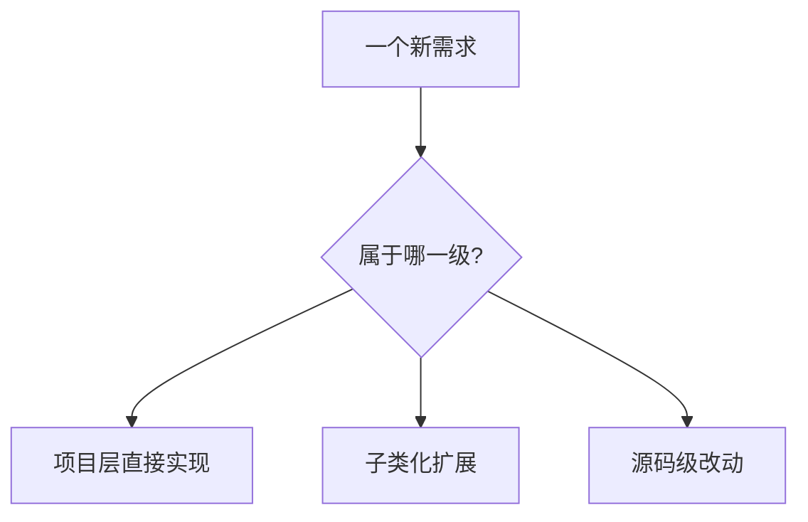
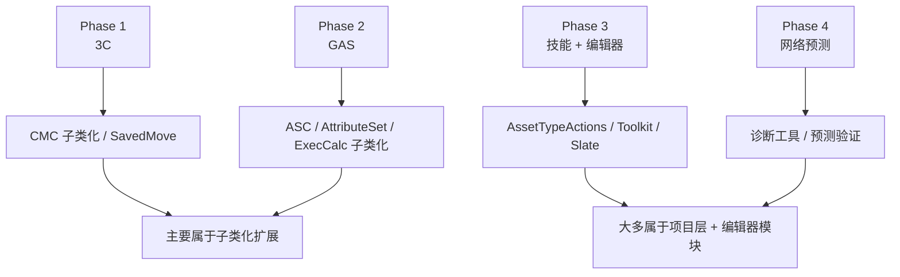
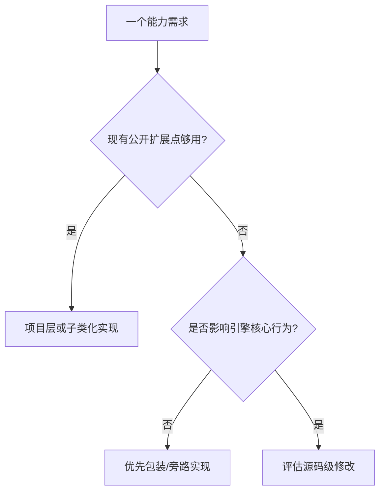

# ZZC Demo：源码扩展分级

> **定位：** 这篇不是实现主线，而是帮助判断“当前需求属于项目层、子类化扩展，还是源码级改动”。  
> **核心目标：** 让读者知道什么时候可以先在项目层完成，什么时候才值得查引擎源码或准备 Source Build。  
> **相关文档：** [3C系统](GAS-3C-Demo-01-3C系统.md) | [编辑器](GAS-3C-Demo-04-编辑器.md) | [网络预测](GAS-3C-Demo-05-网络预测.md)

---

## 本篇总览图

图解说明：
- 这篇解决的是“决策边界”，不是具体代码写法。
- 主线目标是先把绝大多数需求放进“项目层 / 子类化”两层完成。
- 只有明确跨不过现有扩展点时，才进入源码级评估。

---

## Launcher 版与 Source Build 边界

### 统一口径

- **完成 Demo 主线：** 默认使用 Launcher 版 UE 5.4 即可。
- **阅读底层实现或评估源码级扩展：** 再额外准备 Source Build。

### 为什么这样写

- 主线文档 `00A~05` 的大部分内容不要求改引擎源码。
- 如果把 Source Build 写成强制前置，会增加入门成本，也和主线目标冲突。

---

## 分级图

图解说明：
- 从左到右代表实现成本、维护成本和升级成本都在上升。
- 如果一个需求能在更左边解决，就不要贸然往更右边走。

---

## 一、三级定义

| 等级 | 定义 | 典型特点 |
|------|------|----------|
| 项目层 | 直接在项目代码、蓝图、配置中实现 | 风险低、升级友好 |
| 子类化扩展 | 继承引擎 / GAS 类型并覆写扩展点 | 仍然不改引擎源码 |
| 源码级改动 | 必须修改 Engine 或 Plugin 源文件 | 升级需人工合并，维护成本高 |

---

## 二、各 Phase 对应落位图

图解说明：
- 这张图把前面几篇文档中的内容映射回“扩展等级”。
- 你会发现主线其实很少需要真正改引擎源码。
- 这样也能避免一开始就高估工作量。

---

## 三、典型能力归类

| 能力 | 推荐分级 | 说明 |
|------|----------|------|
| Sprint 预测 | 子类化扩展 | 通过 `UCharacterMovementComponent`、`FSavedMove` 扩展即可 |
| Ability 输入标签 | 子类化扩展 | 扩展 ASC / Ability 基类即可 |
| 技能编辑器 | 项目层 + Editor 模块 | 不需要改引擎，只做 Editor-only 插件 |
| 诊断工具 HUD | 项目层 | 直接做 Widget / 调试对象即可 |
| 大世界复制图优化 | 子类化或更高 | 要看 `UReplicationGraph` 是否足够 |
| 深度服务器补偿回卷 | 可能源码级 | 需要严格评估现有扩展点是否足够 |

---

## 四、子类化 vs 改源码决策树

图解说明：
- 先问“有没有公开扩展点”，再问“是不是必须碰核心行为”。
- 很多看起来像“要改源码”的需求，最后都能被包装实现或子类化消化掉。
- 文档层面必须鼓励先走低成本路径，而不是默认上重方案。

---

## 五、什么时候真的需要源码级评估

### 典型信号

- 公开扩展点无法插入所需时机
- 必须修改引擎内部数据结构或复制策略
- 现有 API 无法提供必要的可观测性或控制能力

### 进入源码级前先回答三件事

1. 有没有项目层替代实现
2. 有没有子类化或包装式方案
3. 改源码后升级和维护成本谁来承担

---

## 验收标准

- [ ] 读者能清楚解释三层分级差异
- [ ] 能把 Phase 1~4 主要能力归到正确层级
- [ ] 不再把 Source Build 误认为主线前置条件
- [ ] 知道何时该停在项目层，何时才值得评估源码级改动

---

## 常见问题

### Q1：是不是做 GAS / CMC 就必须用源码版引擎

不是。

主线开发默认 Launcher 版就够。  
源码版的价值主要在于学习、排查和评估更底层的扩展。

### Q2：子类化是不是也很“重”

相对项目层更重，但和真正改引擎源码仍然差一个维护级别。

### Q3：什么时候该停止“继续抽象”

当项目层方案已经满足 Demo 目标时，就不必为了看起来高级而继续上升到更重的级别。

---

## 设计决策

| 决策 | 选择 | 为什么这样做 | 备选方案 | Demo 为什么不选备选 |
|------|------|-------------|----------|--------------------|
| 主线环境要求 | Launcher 版优先 | 降低门槛、加快验证 | Source Build 强制前置 | 与主线目标不匹配 |
| 分级方式 | 项目层 / 子类化 / 源码级 | 最利于判断成本 | 只分“改源码 / 不改源码” | 粒度过粗 |
| 扩展策略 | 能左不右 | 维护成本最低 | 默认追求最强方案 | 容易过度设计 |

---

## 参考资料

- Unreal Engine 源码阅读与模块扩展资料
- CMC / GAS / Editor 扩展相关官方文档
